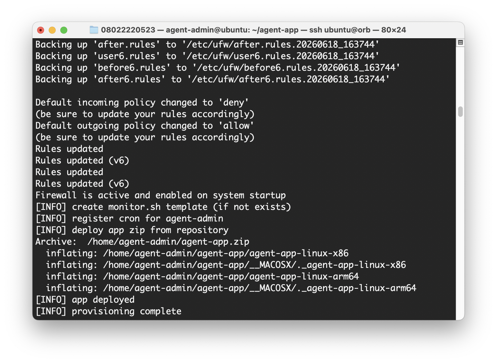
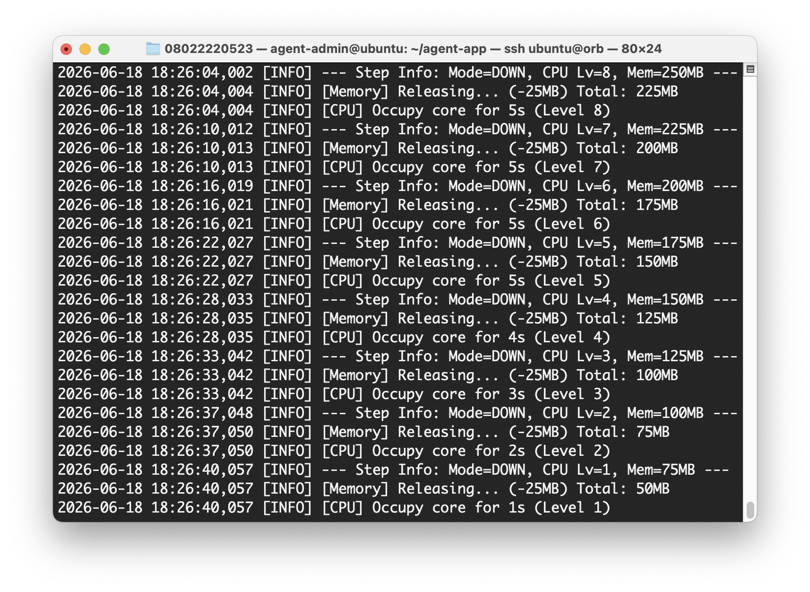
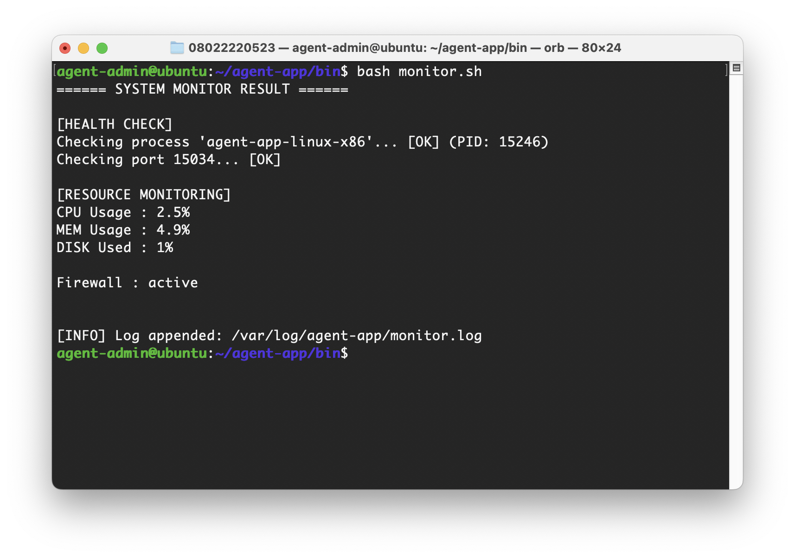
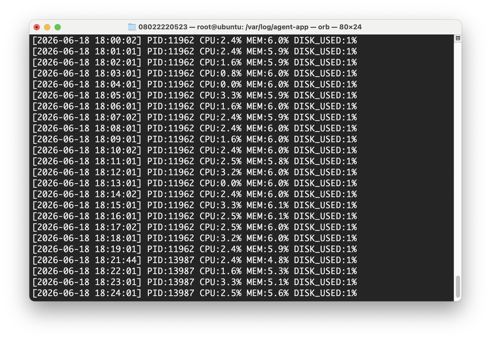

# B1-1 시스템 관제 자동화 스크립트 개발
- 안정적인 서버 운영 환경 직접 구축
- 다중 사용자 환경에서의 권한관리와 네트워크 보안 설정
- 시스템 리소스 관제와 로그 관리를 자동화하는 쉘 스크립트 개발 수행
<br>
<br>

## 핵심 개념
1. SSH 포트변경 & Root 차단
2. 방화벽 (네트워크 보안)
3. 계정/그룹/권한 관리 (최소 권한 원칙)
4. 환경 변수
5. 시스템 모니터링 스크립트
6. 자동 실행 (Crontab)
<br>
<br>

## 파일별 용도

| 파일 | 용도 |
|---|---|
| `README.md` | 메인 안내 문서입니다. OrbStack/일반 Ubuntu VM 기준으로 미션 수행 절차와 검증 흐름을 설명합니다. |
| `docs/README.docker.md` | 수행방법 Docker 컨테이너 기반으로 수행했던 기록을 별도 문서로 분리한 참고용 문서입니다. |
| `scripts/provision.sh` | VM 최초 생성 시 자동 실행되는 프로비저닝 스크립트입니다. 패키지 설치, 계정/그룹, 권한, SSH, UFW, 환경 변수, `monitor.sh`, cron 설정을 자동화합니다. |
| `/home/agent-admin/agent-app/bin/monitor.sh` | 시스템 상태를 점검하고 로그를 남기는 과제 핵심 스크립트입니다. 프로세스/포트/리소스 점검과 경고 출력, 로그 기록을 수행합니다. |
| `/var/log/agent-app/monitor.log` | `monitor.sh` 실행 결과가 누적 기록되는 메인 로그 파일입니다. |
| `/var/log/agent-app/monitor.cron.log` | cron을 통해 `monitor.sh`가 실행될 때 표준 출력과 에러를 기록하는 보조 로그 파일입니다. |
| `agent-app.zip` | 제공된 실행 대상 앱 압축 파일입니다. 과제의 핵심 구현물은 아니며, 서버 환경과 모니터링 스크립트 검증을 위한 실행 대상입니다. |
| 압축 해제된 앱 실행 파일 (`agent-app-linux-x86` 등) | 실제로 `agent-admin` 계정에서 실행하여 Boot Sequence와 포트 리슨 상태를 검증하는 바이너리입니다. |

## 실행 환경 개요

이 미션은 **Ubuntu 22.04 LTS 또는 동등 리눅스 환경**에서 다음 항목을 직접 구성하는 것이 목표입니다.

- SSH 포트(20022) 변경 및 root 원격 로그인 차단
- UFW 기반 방화벽 설정 (20022/tcp, 15034/tcp만 허용)
- 역할 기반 계정/그룹/ACL 설정
- 환경 변수로 실행 경로 고정
- `monitor.sh`로 프로세스/포트/리소스 수집 및 로그 기록
- `crontab`에 등록하여 매분 자동 실행

실습 환경은 크게 두 가지 방식으로 구성했습니다.

- **방법 A: OrbStack / 일반 Ubuntu VM**
- **방법 B: Docker 컨테이너 이용** (./docs/README.docker.md 참고)

---

## 방법 A_OrbStack Vm 이용 (자동 실행)

`OrbStack`을 이용해 **Ubuntu 22.04** 환경을 하나 준비합니다.

아래 순서대로 `시스템 관제 자동화` 스크립트를 개발해 `환경 구축`, `앱 실행`, `모니터링`을 진행합니다.

1. Ubuntu VM 생성

    OrbStack에서 Linux Machine 생성
    
2. VM 접속
   ```bash
   # VM 접속
   orb

   # SSH 접속
   ssh ubuntu@orb
   
   # root 전환
   sudo su -
   ```
3. 프로젝트 클론
   ```bash
   git clone https://github.com/0802222/Codyssey.git
   
   cd Codyssey
   ```
4. 환경 구축 자동화 스크립트 `provision.sh` 실행
    - provision-01-users.sh
    - provision-01-firewall.sh
    - provision-03-monitor.sh
    - provision-04-deploy-app.sh
    ```bash
    bash scripts/provision.sh
    ```
    
5. `agent-app-linux-x86` 앱 실행
    ```bash
    # agent-admin 전환
    sudo su - agent-admin

    cd agent-app
    ./agent-app-linux-x86
    ```
    
6. 모니터링 스크립트 `monitor.sh` 실행 (새로운 터미널에서 orb 접속)
    ```bash
    orb
    ssu ubuntu@orb
    sudo su - agent-admin

    cd ~/agent-app/bin
    bash monitor.sh
    ```
    

7. 로그 확인
    ```bash
    cd /var/log/agent-app
    tail -f monitor.log
    ```
    


---
<br>
<br>

## 방법 A_상세 절차 (수동 실행)
SSH 설정, 방화벽, 계정/그룹, 디렉토리/권한, 환경 변수, 앱 실행, `monitor.sh`, `crontab` 수동 설정 과정입니다.

## 0. 의존성 설치
- 패키지 설치 - `apt`
    
    `apt` 는 인터랙티브 사용을 기준으로 설계돼서, 일반 `사용자들이 터미널에서` 쓰기 좋다.

    cf. VM에 로그인한 후 실행
    
    ```bash
    # 설치 가능한 패키지 목록 받아오기
    apt update
  
    # 최신 버전으로 업그레이드 하기 (-y : 업그레이드 중 Yes/No 질문에 자동으로 Yes라고 답하는 옵션)
    apt upgrade -y

    # 4개의 패키지를 설치하고 자동으로 Yes 라고 답하기
    # nano : 텍스트 에디터
    # openssh-server : ssh 서버
    # ufw : 방화벽
    # cron : 스케쥴 실행 도구
    apt install -y nano openssh-server ufw cron
    ```
    
- 패키지 설치 - `apt-get`

    `apt-get` 은 출력이 심플해서, `스크립트/자동화`에서 파싱하기 좋고, 오래전부터 쓰여왔기 때문에 호환성과 안정성이 높다.
    
    ```bash
    # 업그레이드
    apt-get update

    # 패키지 설치
    # iproute2 : IP 주소, 라우팅, 네트워크 인터페이스 등을 관리하는 네트워크 유틸리티 모음
    # net-tools : ifconfig, netstat 같은 구버전 네트워크 도구 모음
    # acl : 파일/디렉토리 접근권한을 세밀하게 제어하기 위한 Access Control List 도구
    # sudo : 일반 사용자가 제한된 범위에서 root 권한 명령을 실행할 수 있게 해주는 권한 상승 도구
    apt-get install -y iproute2 net-tools acl sudo
  
    ```


<br>
<br>

# 1. 기본 보안 설정
## 1-1. SSH Port 변경 (22 -> 20022)
### 포트를 왜 바꿔야 하나요?
기본 포트(22)는 봇 스캐닝, 무차별 대입 공격이 제일 많이 들어오기때문에, 포트를 바꾸는 것 만으로도 노이즈 트래픽을 크게 줄일 수 있다.

### 어디서 바꾸나요?
SSH Port 는 `sshd_config` 에서 수정할 수 있고, 

그 외 서버 데몬도 설정도 (외부 서버 -> 내 서버 SSH 접속 시) 할 수 있다.

- `Port`: SSH가 사용할 포트 번호 (기본값 22) -> `20022 로 변경`
- `PermitRootLogin`: root 계정의 원격 로그인 허용 여부 -> `no 로 차단`
- `PasswordAuthentication`: 비밀번호 인증 허용 여부
- `PubkeyAuthentication`: 공개키 인증 허용 여부
- `Protocol`: SSH 프로토콜 버전 선택 (보안상 2 권장)
- `ListenAddress`: SSH 서버가 특정 IP 주소로만 접속 받도록 설정

(cf. `ssh_config` : 클라이언트 설정 (내 서버 -> 외부 서버 접속 시))
<br>
<br>


### 1. Port 변경
이미 컨테이너의 `root 권한`을 가지고 있기 때문에 `sudo` 명령어 없이 바로 편집할 수 있다.
- `sshd_config` 파일 열기
    ```bash
    nano /etc/ssh/sshd_config
    ```
- 포트 변경

    Port `22` 를 주석 해제 하고, Port `20022` 로 변경한다.
    


- 포트 변경 확인
    ```bash
    root@ubuntu:~# cat /etc/ssh/sshd_config | grep Port
    Port 20022
    ```
    
    포트 변경 후 SSH 데몬이 `20022` 포트로 리스닝하도록 설정되었다. 

    
<br>
<br>

### 2. SSH 재시작
변경사항 적용을 위해 데몬을 재시작 한다.
```bash
# service ssh restart
root@ubuntu:~# service ssh restart
    
* Restarting OpenBSD Secure Shell server sshd  
```
<br>

### 3. Port 변경 확인
- 확인 방법1. `netstat` (Network Statistics)
    
    현재 LISTEN 중인 TCP/UDP 포트 목록 + 그 포트를 잡고 있는 프로세스(PID/이름)를 보여준다.
    - `t` : TCP 연결만 표시
    - `u` : UDP 연결만 표시
    - `l` : LISTEN 중인 소켓만 표시 (즉, “연결 대기 중인 포트”만)
    - `n` : 도메인/서비스 이름 대신 숫자(IP, 포트 번호) 그대로 표시 예: :ssh 대신 :22
    - `p` : 그 포트를 사용 중인 프로세스의 PID와 프로그램 이름을 같이 표시
    ```bash
    netstat -tulnp | grep 20022

    tcp        0      0 0.0.0.0:20022           0.0.0.0:*               LISTEN      4552/sshd: /usr/sbi 
    tcp6       0      0 :::20022                :::*                    LISTEN      4552/sshd: /usr/sbi 
    ```

- 확인 방법2. `ss` (Socket Statistics)

    netstat의 최신 버전같은 도구, LISTEN 포트와 프로세스 정보를 더 빠르게 보여준다.
    ```bash
    ss -tulnp | grep 20022

    Netid   State    Recv-Q   Send-Q     Local Address:Port      Peer Address:Port  Process                                                                         
    tcp     LISTEN   0        128              0.0.0.0:20022          0.0.0.0:*      users:(("sshd",pid=4552,fd=6))                                                 
    tcp     LISTEN   0        128                 [::]:20022             [::]:*      users:(("sshd",pid=4552,fd=7))   
    ```

- 확인 방법3. `ps aux | grep` 프로세스
    
    시스템의 모든 실행중인 프로세스 + 동작 모드 상세 표시 명령어
    ```bash
    ps aux | grep sshd

    root        4552  0.0  0.0  10736  2400 ?        Ss   18:42   0:00 sshd: /usr/sbin/sshd [listener] 0 of 10-100 startups
    root        4625  0.0  0.0   3692  2096 pts/0    S+   18:47   0:00 grep --color=auto sshd
    ```

<br>
<br>


## 1-2. ROOT 로그인 차단 (prohibit-password -> no)
`root` 는 시스템 전체 권한이라 한번 탈취되면 방어수단이 거의 없어서, 일반 계정(`agent-admin`)으로 접속하고 `필요한 경우에만 sudo` 로 실행한다.

Root 로그인도 `sshd_config` 파일에서 수정할 수 있다.
### 1. 권한 변경 (전)
```bash
root@ubuntu:~# grep '^#\?PermitRootLogin' /etc/ssh/sshd_config
#PermitRootLogin prohibit-password
```    

`PermitRootLogin`를 `prohibit-password` 를 `no` 로 변경한다.

```bash
sudo sed -i 's/^#\?PermitRootLogin.*/PermitRootLogin no/' /etc/ssh/sshd_config
```


### 2. 권한 변경 (후)
```bash
grep '^#\?PermitRootLogin' /etc/ssh/sshd_config
PermitRootLogin no
```


### cf. PermitRootLogin 의 옵션
    - yes : Root 로그인 허용 (비밀번호 가능)  
    - no : Root 로그인 차단 (완전히 차단)
    - prohibit-password : Root 로그인은 허용하되, 비밀번호 인증은 금지한다. (공개키 인증으로만 접속가능)

### 3. 서비스 재시작
```bash
root@ubuntu:~# service ssh restart
```


<br>
<br>

# 2. 방화벽 설정
### 방화벽 종류
1. `UFW` (Uncomplicated Firewall) -> 이걸로 진행
- iptables 래퍼
- Ubuntu, Debian
- 초보자 친화적

2. `Firewalld`
- iptables/nftables 래퍼
- RedHat, CentOS, Fedora
- 고급 기능 많음


## 2-1. 방화벽 설정
`최소 권한 원칙`에 따라 미션에서 요구하는 서비스 2개 (SSH 20022/tcp, 앱 15034/tcp) 만 인바운드 허용하고, 나머지는 기본정책으로 불필요한 포트 노출을 차단한다.

- UFW 활성화
    ```bash
    # ufw enable
    root@ubuntu:~# ufw enable
    
    Firewall is active and enabled on system startup
    ```
- SSH 포트 허용 (20022)
    ```bash
    # ufw allow 20022/tcp
    root@ubuntu:~# ufw allow 20022/tcp
    
    Rule added
    Rule added (v6)
    ```
- APP 포트 허용 (15034)
    ```bash
    # ufw allow 15034/tcp
    root@ubuntu:~# ufw allow 15034/tcp

    Rule added
    Rule added (v6)
    ```

### 2-2. 방화벽 상태 확인
- ufw status
```bash
root@ubuntu:~# ufw status
Status: active

To                         Action      From
--                         ------      ----
20022/tcp                  ALLOW       Anywhere                  
15034/tcp                  ALLOW       Anywhere                  
20022/tcp (v6)             ALLOW       Anywhere (v6)             
15034/tcp (v6)             ALLOW       Anywhere (v6)  
```
<br>
<br>

# 3. 계정/그룹/권한 설정

### 3-1. 그룹 생성
그룹을 `common`, `core` 로 나누어 생성하여, 테스트 계정은 앱 로그나 키 파일에는 접근하지 못하고, 업로드용 경로만 사용할 수 있도록 제한한다.
- `agent-common` 그룹: `admin`/`dev`/`test` 모두 포함 
    → `upload_files` 같이 같이 쓰는 경로에 `R`/`W` 권한 부여

- `agent-core` 그룹: `admin`/`dev`만 포함 
    → `api_keys`, `/var/log/agent-app` 같이 민감한 정보/운영 로그에는 이 그룹 사용자만 접근 가능하게 설정

```bash
# 그룹 생성
root@ubuntu:~# groupadd agent-common
root@ubuntu:~# groupadd agent-core

# 그룹 생성 확인
root@ubuntu:~# getent group | grep agent

agent-common:x:1000:
agent-core:x:1001:
```

### 3-2. 계정 생성
- agent-admin : 관리자
- agent-dev : 스크립트 작성, 실행
- agent-test : 테스트 수행

- `m` : 홈 디렉터리 생성
- `s` : 기본 로그인 쉘 지정

    ```bash
    root@ubuntu:~# useradd -m -s /bin/bash agent-admin
    root@ubuntu:~# useradd -m -s /bin/bash agent-dev  
    root@ubuntu:~# useradd -m -s /bin/bash agent-test
    ```


### 3-3. 그룹 소속 시키기
- `-aG` : 기존 그룹을 유지하면서 보조그룹(G)에 추가(a)
- `-G` : 기존 그룹을 현재 그룹으로 완전히 교체

    ```bash
    # agent-common
    root@ubuntu:~# usermod -aG agent-common agent-admin
    root@ubuntu:~# usermod -aG agent-common agent-dev
    root@ubuntu:~# usermod -aG agent-common agent-test

    # agent-core
    root@ubuntu:~# usermod -aG agent-core agent-admin 
    root@ubuntu:~# usermod -aG agent-core agent-dev
    ```

### 3-4. 그룹 설정 후 계정 확인 - `id <계정 명>`
```bash
# id <계정 명>
root@ubuntu:~# id agent-admin
uid=1000(agent-admin) gid=1002(agent-admin) groups=1002(agent-admin),1000(agent-common),1001(agent-core)

root@ubuntu:~# id agent-dev
uid=1001(agent-dev) gid=1003(agent-dev) groups=1003(agent-dev),1000(agent-common),1001(agent-core)

root@ubuntu:~# id agent-test
uid=1002(agent-test) gid=1004(agent-test) groups=1004(agent-test),1000(agent-common)
```
---

## 미션 외
### 계정 수정
- 계정 이름 + 홈 디렉토리 같이 변경
- `-l` : 로그인 이름 변경 (old -> new)
- `-d <경로>` : 홈 디렉토리도 새 계정 명으로 변경
- `-m <경로>` : 기존 홈 내용을 새 경로로 이동
    ```bash
    # usermod -l <새 계정 명> -d <새 경로> -m <새 경로>
    usermod -l agent-new -d /home/agent-new -m agent-old
    ```

### 계정 삭제
- `-r` : 설정했던 하위 옵션까지 삭제

    ```bash
    # userdel -r <계정 명>
    userderl -r agent-admin

    # userdel 만 실행할 경우 남아 있는 홈 디렉터리 삭제 필요
    rm -rf /hone/agent-admin
    ```


### 그룹 수정
- 현재 그룹 확인
    ```bash
    # getent group <기존 계정 명>
- 그룹 수정

    ```bash
    # groupmod -n <새 계정 명> <기존 계정 명>
    groupmod -n agent-new agent-old
    ```


### 그룹 삭제 
- 그룹이 실제로 존재하는지 확인
    ```bash
    # getent group <그룹 명>
    getent group agent-old
    ```
- 이 그룹을 기본 그룹으로 쓰는 사용자가 있는지 확인
    ```bash
    # grep <그룹 명> /etc/passwd
    grep agent-old /etc/passwd
    ```
- 기본 그룹으로 사용중이라면 새그룹을 만들고, 사용자 기본그룹을 새 그룹으로 변경
    ```bash
    # usermod -g <새 그룹 명> <사용자 명>
    groupadd agent-new
    ```
- 그룹 삭제
    ```bash
    # groupdel <그룹 명>
    groupdel agent-old
    ```

<br>

---

## 3-5.디렉토리
### 디렉토리 생성 및 확인

```bash
# 디렉토리 생성
mkdir -p /home/agent-admin/agent-app
mkdir -p /home/agent-admin/agent-app/bin
mkdir -p /home/agent-admin/agent-app/upload_files
mkdir -p /home/agent-admin/agent-app/api_keys

# 디렉토리 확인
root@ubuntu:~# cd /home/agent-admin/agent-app
root@ubuntu:/home/agent-admin/agent-app# ls   
api_keys  bin  upload_files
```

### 디렉토리 소유자 변경 - `agent-app`
- 변경 전 : 소유자 agent-admin, 그룹 `agent-admin (admin)`

    ```bash
    chown -R agent-admin:agent-core /home/agent-admin/agent-app
    ```

    - `chown` : change owner, 파일/ 디렉토리 소유자와 그룹 변경
    - `R` : Recursive(재귀적) 옵션, 지정 디렉토리 및 그 안의 하위 디렉토리/파일까지 일괄 변경
    
- 변경 후 : 소유자 agent-admin, 그룹 `agent-core (admin, dev)`
    
    ```bash
    root@ubuntu:/home/agent-admin/agent-app# ls -al
    total 0
    drwxr-xr-x 1 agent-admin agent-core  46 Jun  4 19:36 .
    drwxr-x--- 1 agent-admin agent-admin 72 Jun  4 19:36 ..
    drwxr-xr-x 1 agent-admin agent-core   0 Jun  4 19:36 api_keys
    drwxr-xr-x 1 agent-admin agent-core   0 Jun  4 19:36 bin
    drwxr-xr-x 1 agent-admin agent-core   0 Jun  4 19:36 upload_files
    ```


### 디렉토리 권한 변경 - `upload_files` (agent-common 모두 접근 가능)
소유/그룹을 `agent-admin:agent-common`으로 두고, 그룹에 쓰기 권한을 줘서 모든 역할이 업로드 가능하게 한다.
- 변경 전 : 디렉토리 권한 `755(drwxr-xr-x)`, 디렉토리 그룹 `agent-core`

    ```bash
    # 디렉토리의 권한 변경
    chmod 770 /home/agent-admin/agent-app/upload_files

    # 디렉토리의 그룹 변경
    chgrp agent-common /home/agent-admin/agent-app/upload_files
    ```


- 변경 후 : 디렉토리 권한 `770(drwxrwx---)`, 디렉토리 그룹 `agent-common`
    ```bash
    root@ubuntu:/home/agent-admin/agent-app# ls -al
    total 0
    drwxr-xr-x 1 agent-admin agent-core   46 Jun  4 19:36 .
    drwxr-x--- 1 agent-admin agent-admin  72 Jun  4 19:36 ..
    drwxr-xr-x 1 agent-admin agent-core    0 Jun  4 19:36 api_keys
    drwxr-xr-x 1 agent-admin agent-core    0 Jun  4 19:36 bin
    drwxrwx--- 1 agent-admin agent-common  0 Jun  4 19:36 upload_files # 770, agent-common 으로 변경
    ```

### 디렉토리 권한 변경 - `api_keys` (agent-core만 접근)
`agent-admin:agent-core`와 그룹 쓰기로 묶어서, admin/dev만 내용을 보고 쓸 수 있게 한다.
- 변경 전 : 디렉토리 권한 `755(drwxr-xr-x)`, 디렉토리 그룹 agent-core
    ```bash
    # 디렉토리의 권한 변경
    chmod 750 /home/agent-admin/agent-app/api_keys

    # 디렉토리의 그룹 변경
    chgrp agent-core /home/agent-admin/agent-app/api_keys
    ```
- 변경 후 : 디렉토리 권한 `750(drwxr-x---)`, 디렉토리 그룹 agent-core

    ```bash
    root@ubuntu:/home/agent-admin/agent-app# ls -al
    total 0
    drwxr-xr-x 1 agent-admin agent-core   46 Jun  4 19:36 .
    drwxr-x--- 1 agent-admin agent-admin  72 Jun  4 19:36 ..
    drwxr-x--- 1 agent-admin agent-core    0 Jun  4 19:36 api_keys # 750 으로 변경
    drwxr-xr-x 1 agent-admin agent-core    0 Jun  4 19:36 bin
    drwxrwx--- 1 agent-admin agent-common  0 Jun  4 19:36 upload_files
    ```

---

## 3-6. 로그 디렉토리
- 로그 디렉토리 생성
    ```bash
    mkdir -p /var/log/agent-app
    ```

- 변경 전 : 디렉토리 소유자 `root:root` , 디렉토리 권한 `755(drwxr-xr-x)`
    ```bash
    root@ubuntu:/var/log/agent-app# ls -al
    total 0
    drwxr-xr-x 1 root        root         0 Jun  4 19:38 .
    drwxrwxr-x 1 root        syslog     322 Jun  4 19:38 ..
    ```

- 로그 디렉토리 소유자 및 권한 변경
    ```bash
    # 디렉토리의 소유자 변경
    chown agent-admin:agent-core /var/log/agent-app

    # 디렉토리의 권한 변경
    chmod 770 /var/log/agent-app
    ```

- 변경 후 : 디렉토리 소유자 `agent-admin:agent-core` , 디렉토리 권한 `770(drwxrwx---)`
    ```bash
    root@ubuntu:/var/log/agent-app# ls -al
    total 0
    drwxrwx--- 1 agent-admin agent-core   0 Jun  4 19:38 .  # 770, agent-admin:agent-core 로 변경
    drwxrwxr-x 1 root        syslog     322 Jun  4 19:38 ..
    ```

## 3-7. ACL 설정 확인
- `ACL` 이란?

     : Access Control List, **기본권한(rwx)보다 상세한 권한 설정을 가능**하게하는 시스템
    - `setfacl` : 파일이나 디렉토리의 ACL 설정
    - `getfacl` : 파일이나 디렉토리의 ACL 설정 확인


- `agent-app` 디렉토리 권한 확인
    ```bash
    root@ubuntu:/var/log/agent-app# ls -l /home/agent-admin/agent-app/
    total 0
    drwxr-x--- 1 agent-admin agent-core   0 Jun  4 19:36 api_keys
    drwxr-xr-x 1 agent-admin agent-core   0 Jun  4 19:36 bin
    drwxrwx--- 1 agent-admin agent-common 0 Jun  4 19:36 upload_files
    ```

- ACL 설정 확인 - `upload_files`
    ```bash
    root@ubuntu:/var/log/agent-app# getfacl /home/agent-admin/agent-app/upload_files/
    getfacl: Removing leading '/' from absolute path names
    # file: home/agent-admin/agent-app/upload_files/
    # owner: agent-admin
    # group: agent-common
    user::rwx
    group::rwx
    other::---
    ```

- ACL 설정 확인 - `api_keys`
    ```bash
    root@ubuntu:/var/log/agent-app# getfacl /home/agent-admin/agent-app/api_keys
    getfacl: Removing leading '/' from absolute path names
    # file: home/agent-admin/agent-app/api_keys
    # owner: agent-admin
    # group: agent-core
    user::rwx
    group::r-x
    other::---
    ```
<br>
<br>

# 4. 환경변수
앱이 부팅할 때 아래 환경변수 값을 기준으로 경로와 포트를 검증한다.
환경변수로 경로를 고정해두면, 디렉토리 구조가 바뀌어도 스크립트만 수정하면 전체동작을 일관되게 유지할 수 있기 때문에 사용성 면에서 편리하다.


## 4-1. 환경변수 설정
`agent-admin`의 bash 프로필에 환경 변수 추가
```bash
nano /home/agent-admin/.bashrc
```

- `/.bashrc` 파일 맨 끝에 추가
    ```bash
    export AGENT_HOME=/home/agent-admin/agent-app
    export AGENT_PORT=15034
    export AGENT_UPLOAD_DIR=$AGENT_HOME/upload_files
    export AGENT_KEY_PATH=$AGENT_HOME/api_keys
    export AGENT_LOG_DIR=/var/log/agent-app
    ```

- 저장
    ```bash
    source /home/agent-admin/.bashrc
    ```

- 확인
    ```bash
    root@ubuntu:/var/log/agent-app# env | grep AGENT_
    AGENT_UPLOAD_DIR=/home/agent-admin/agent-app/upload_files
    AGENT_PORT=15034
    AGENT_KEY_PATH=/home/agent-admin/agent-app/api_keys
    AGENT_HOME=/home/agent-admin/agent-app
    AGENT_LOG_DIR=/var/log/agent-app
    ```


## 4-2. API 키 생성

- 사용자 전환 (root -> agent-admin)
    ```bash
    agent-admin@ubuntu:~/agent-app$ su - agent-admin
    ```
    - `su` : Switch User, 다른 사용자로 전환하되 기존 사용자의 환경변수 유지 (옵션없이 su 만 입력하면 root 로 전환)
    - `su -` :다른 사용자로 완전히 전환하며, 환경변수와 홈 디렉토리 까지 변경 됨 (사용자명 없으면 root로 완전히 전환)
    - `sudo` : SuperUser Do, 권한만 빌려서 단일 명령어 실행

    - `exit` : exit 명령으로 logout 후 원래 계정으로 돌아온다.

- 키 파일 생성
    
    ```bash
    echo "agent_api_key_test" > /home/agent-admin/agent-app/api_keys/secret.key
    ```

- root 세션에서 권한 설정
    소유자(`agent-admin`)만 `읽기/쓰기` 가 가능하게 하고, `그룹`은 내용 `확인`, `기타` 사용자는 `접근 불가`로 한다.
    ```bash
    exit
    chmod 640 /home/agent-admin/agent-app/api_keys/secret.key
    ```

- 확인
    ```bash
    cat /home/agent-admin/agent-app/api_keys/secret.key

    agent_api_key_test
    ```
.png)

## 4-3. 앱 실행 (./agent-app-linux-x86)
### 앱 실행 준비
- 비밀번호 만들기
    ```bash
    # password 입력
    sudo passwd c08022220523
    ```
- (VM 기준) 호스트에서 VM으로 파일 복사
    ```bash
    scp -P 20022 \
    -i ~/.orbstack/ssh/id_ed25519 \
    /Users/08022220523/Downloads/agent-app.zip \
    c08022220523@192.168.139.237:/home/c08022220523/
    ```
- VM에 SSH 접속
  ```bash
  ssh -p 20022 c08022220523@192.168.139.237

  Welcome to Ubuntu 22.04.5 LTS (GNU/Linux 6.17.8-orbstack-00308-g8f9c941121b1 x86_64)

    * Documentation:  https://help.ubuntu.com
    * Management:     https://landscape.canonical.com
    * Support:        https://ubuntu.com/pro

  ```
- root → agent-admin으로 전환 후 실행
  ```bash
  sudo su -
  su - agent-admin
  cd $AGENT_HOME
  ./agent-app-linux-x86
  ```


### 앱 실행 & 정상 출력 확인

- agent-admin 으로 실행할 때 (정상 출력)
    ```bash
    agent-admin@abc123:~/agent-app$ ./agent-app-linux-x86
    >>> Starting Agent Boot Sequence...
    [1/5] Checking User Account               [OK]
    ... Running as service user 'agent-admin' (uid=1001)
    [2/5] Verifying Environment Variables     [OK]
    ... All required Envs correct
    [3/5] Checking Required Files             [OK]
    ... Verified 'secret.key' with correct key string.
    [4/5] Checking Port Availability          [OK]
    ... Port 15034 is available. # 포트 리슨
    [5/5] Verifying Log Permission            [OK]
    ... Log directory is writable: /var/log/agent-app
    ------------------------------------------------------------
    All Boot Checks Passed!
    Agent READY
    ```
    

- root 로 실행할 때 (권한을 agent-admin 만 줬기 때문에 차단됨)
    ```bash
    root@abc123:/home/agent-admin/agent-app# ./agent-app-linux-x86 
    >>> Starting Agent Boot Sequence...
    [1/5] Checking User Account               [FAIL]
    >>> Error: Running as 'root' is forbidden.
    [2/5] Verifying Environment Variables     [FAIL]
    >>> Skipped due to previous critical failure.
    [3/5] Checking Required Files             [FAIL]
    >>> Skipped due to previous critical failure.
    [4/5] Checking Port Availability          [FAIL]
    >>> Skipped due to previous critical failure.
    [5/5] Verifying Log Permission            [FAIL]
    >>> Skipped due to previous critical failure.
    --------------------------------------------------
    System Boot Failed. Process Terminated.
    ```


## 4-4. 앱 : 부하시뮬레이션
앱이 실행되고, `Agent READY` 상태가 되면 자동으로 `CPU 레벨`과 `메모리 사용량`을 25MB 씩 주기적으로 올렸다가(`UP`), 최대치에서 다시 내려오는(`DOWN`) 부하 시뮬레이션 진행

```bash
# UP
2026-05-29 15:48:27,665 [INFO] [SafetyGuard] Process priority lowered (nice=10).
2026-05-29 15:48:27,666 [INFO] Agent listening at port 15034
2026-05-29 15:48:27,666 [INFO] === Agent Worker Started ===
2026-05-29 15:48:27,666 [INFO]    > Cycle: 0 -> 256MB/Lv10 -> 0
2026-05-29 15:48:27,666 [INFO] --- Step Info: Mode=UP, CPU Lv=1, Mem=0MB ---
2026-05-29 15:48:27,704 [INFO] [Memory] Increasing... (+25 MB) Total: 25 MB
2026-05-29 15:48:27,705 [INFO] [CPU] Occupy core for 1s (Level 1)
2026-05-29 15:48:29,713 [INFO] --- Step Info: Mode=UP, CPU Lv=2, Mem=25MB ---
2026-05-29 15:48:29,752 [INFO] [Memory] Increasing... (+25 MB) Total: 50 MB
2026-05-29 15:48:29,752 [INFO] [CPU] Occupy core for 2s (Level 2)
2026-05-29 15:48:32,759 [INFO] --- Step Info: Mode=UP, CPU Lv=3, Mem=50MB ---
2026-05-29 15:48:32,778 [INFO] [Memory] Increasing... (+25 MB) Total: 75 MB
2026-05-29 15:48:32,778 [INFO] [CPU] Occupy core for 3s (Level 3)
2026-05-29 15:48:36,786 [INFO] --- Step Info: Mode=UP, CPU Lv=4, Mem=75MB ---
2026-05-29 15:48:36,828 [INFO] [Memory] Increasing... (+25 MB) Total: 100 MB
2026-05-29 15:48:36,828 [INFO] [CPU] Occupy core for 4s (Level 4)
2026-05-29 15:48:41,836 [INFO] --- Step Info: Mode=UP, CPU Lv=5, Mem=100MB ---
2026-05-29 15:48:41,877 [INFO] [Memory] Increasing... (+25 MB) Total: 125 MB
2026-05-29 15:48:41,877 [INFO] [CPU] Occupy core for 5s (Level 5)
2026-05-29 15:48:47,884 [INFO] --- Step Info: Mode=UP, CPU Lv=6, Mem=125MB ---
2026-05-29 15:48:47,924 [INFO] [Memory] Increasing... (+25 MB) Total: 150 MB
2026-05-29 15:48:47,924 [INFO] [CPU] Occupy core for 5s (Level 6)
2026-05-29 15:48:53,931 [INFO] --- Step Info: Mode=UP, CPU Lv=7, Mem=150MB ---
2026-05-29 15:48:53,972 [INFO] [Memory] Increasing... (+25 MB) Total: 175 MB
2026-05-29 15:48:53,972 [INFO] [CPU] Occupy core for 5s (Level 7)
2026-05-29 15:48:59,980 [INFO] --- Step Info: Mode=UP, CPU Lv=8, Mem=175MB ---
2026-05-29 15:49:00,023 [INFO] [Memory] Increasing... (+25 MB) Total: 200 MB
2026-05-29 15:49:00,023 [INFO] [CPU] Occupy core for 5s (Level 8)
2026-05-29 15:49:06,029 [INFO] --- Step Info: Mode=UP, CPU Lv=9, Mem=200MB ---
2026-05-29 15:49:06,072 [INFO] [Memory] Increasing... (+25 MB) Total: 225 MB
2026-05-29 15:49:06,072 [INFO] [CPU] Occupy core for 5s (Level 9)
2026-05-29 15:49:12,078 [INFO] --- Step Info: Mode=UP, CPU Lv=10, Mem=225MB ---
2026-05-29 15:49:12,120 [INFO] [Memory] Increasing... (+25 MB) Total: 250 MB
2026-05-29 15:49:12,120 [INFO] [CPU] Occupy core for 5s (Level 10)
2026-05-29 15:49:18,127 [INFO] --- Step Info: Mode=UP, CPU Lv=10, Mem=250MB ---
2026-05-29 15:49:18,135 [INFO] [Memory] Increasing... (+25 MB) Total: 275 MB
2026-05-29 15:49:18,135 [INFO] [CPU] Occupy core for 5s (Level 10)
# DOWN
2026-05-29 15:49:24,142 [INFO] >>> PEAK REACHED (Max Load). Switching to RAMP DOWN. ▼ <<<
2026-05-29 15:49:24,146 [INFO] --- Step Info: Mode=DOWN, CPU Lv=9, Mem=275MB ---
2026-05-29 15:49:24,147 [INFO] [Memory] Releasing... (-25MB) Total: 250MB
2026-05-29 15:49:24,147 [INFO] [CPU] Occupy core for 5s (Level 9)
2026-05-29 15:49:30,153 [INFO] --- Step Info: Mode=DOWN, CPU Lv=8, Mem=250MB ---
2026-05-29 15:49:30,154 [INFO] [Memory] Releasing... (-25MB) Total: 225MB
2026-05-29 15:49:30,154 [INFO] [CPU] Occupy core for 5s (Level 8)
2026-05-29 15:49:36,161 [INFO] --- Step Info: Mode=DOWN, CPU Lv=7, Mem=225MB ---
2026-05-29 15:49:36,162 [INFO] [Memory] Releasing... (-25MB) Total: 200MB
2026-05-29 15:49:36,162 [INFO] [CPU] Occupy core for 5s (Level 7)
2026-05-29 15:49:42,170 [INFO] --- Step Info: Mode=DOWN, CPU Lv=6, Mem=200MB ---
2026-05-29 15:49:42,171 [INFO] [Memory] Releasing... (-25MB) Total: 175MB
2026-05-29 15:49:42,171 [INFO] [CPU] Occupy core for 5s (Level 6)
2026-05-29 15:49:48,178 [INFO] --- Step Info: Mode=DOWN, CPU Lv=5, Mem=175MB ---
2026-05-29 15:49:48,179 [INFO] [Memory] Releasing... (-25MB) Total: 150MB
2026-05-29 15:49:48,179 [INFO] [CPU] Occupy core for 5s (Level 5)
2026-05-29 15:49:54,187 [INFO] --- Step Info: Mode=DOWN, CPU Lv=4, Mem=150MB ---
2026-05-29 15:49:54,188 [INFO] [Memory] Releasing... (-25MB) Total: 125MB
2026-05-29 15:49:54,188 [INFO] [CPU] Occupy core for 4s (Level 4)
2026-05-29 15:49:59,196 [INFO] --- Step Info: Mode=DOWN, CPU Lv=3, Mem=125MB ---
2026-05-29 15:49:59,196 [INFO] [Memory] Releasing... (-25MB) Total: 100MB
2026-05-29 15:49:59,197 [INFO] [CPU] Occupy core for 3s (Level 3)
2026-05-29 15:50:03,204 [INFO] --- Step Info: Mode=DOWN, CPU Lv=2, Mem=100MB ---
2026-05-29 15:50:03,205 [INFO] [Memory] Releasing... (-25MB) Total: 75MB
2026-05-29 15:50:03,205 [INFO] [CPU] Occupy core for 2s (Level 2)
2026-05-29 15:50:06,213 [INFO] --- Step Info: Mode=DOWN, CPU Lv=1, Mem=75MB ---
2026-05-29 15:50:06,214 [INFO] [Memory] Releasing... (-25MB) Total: 50MB
2026-05-29 15:50:06,214 [INFO] [CPU] Occupy core for 1s (Level 1)
2026-05-29 15:50:08,222 [INFO] --- Step Info: Mode=DOWN, CPU Lv=0, Mem=50MB ---
2026-05-29 15:50:08,223 [INFO] [Memory] Releasing... (-25MB) Total: 25MB
2026-05-29 15:50:09,229 [INFO] --- Step Info: Mode=DOWN, CPU Lv=0, Mem=25MB ---
2026-05-29 15:50:09,230 [INFO] [Memory] Releasing... (-25MB) Total: 0MB
# 다시 UP
2026-05-29 15:50:10,236 [INFO] >>> BOTTOM REACHED (Idle). Switching to RAMP UP. ▲ <<<
2026-05-29 15:50:10,236 [INFO] --- Step Info: Mode=UP, CPU Lv=1, Mem=0MB ---
2026-05-29 15:50:10,274 [INFO] [Memory] Increasing... (+25 MB) Total: 25 MB
2026-05-29 15:50:10,275 [INFO] [CPU] Occupy core for 1s (Level 1)

```

### 다른 터미널에서 포트 확인
```bash
agent-admin@abc123:/var/log/agent-app$ ss -tulnp | grep 15034
tcp   LISTEN 0      1            0.0.0.0:15034      0.0.0.0:*    users:(("agent-app-linux",pid=1097,fd=4))

# 결과: 0.0.0.0:15034 LISTEN
```
<br>
<br>

# 5. 모니터링 스크립트
자동으로 시스템의 상태를 체크하고 기록한다.

`수동 모니터링` 시 매 분 체크가 불가능하며, 실수하기 쉽고 기록이 없는 반면,
`자동 모니터링` 시 24/7 감시 가능하며, 휴먼에러가 없고 기록이 남아 데이터 기반 분석이 가능하다.


### monitor.sh 의 5가지 기능
1. 헬스 체크 (실패 시 종료)
    - 프로세스 : `agent-app-linux-x86` 이 실행중 인지 확인
    - 포트 : 15034 수신중 인지 확인
    
    비정상 상태에서 리포트를 만들어 내는 것보다는 바로 종료하고, 실패 로그만 남기는 쪽이 문제를 추적하기 좋다고 판단해서 `exit 1`로 끝내도록 한다.

2. 경고 체크 (경고만 출력)
    - 방화벽 활성화 상태 확인
    - 비활성 상태이거나 도구가 없으면 `[WARNING]` 만 남기고 스크립트는 계속 진행

3. 자원 수집
    - CPU 사용률(%) : `top -bn1`의 `Cpu(s)` 라인에서 idle 퍼센트를 뽑고, `100 - idle`로 사용률을 계산
    - 메모리 사용률(%) : `free` 명령의 `Mem`: 라인에서 `used/total * 100`으로 계산
    - 디스크 사용률(%) ; `df -P /`로 `루트 파티션`을 기준으로 사용률(%)을 가져옴
4. 임계값 경고
    - `CPU > 20%: [WARNING] CPU threshold exceeded`
    - `MEM > 10%: [WARNING] MEM threshold exceeded`
    - `DISK_USED > 80%: [WARNING] DISK threshold exceeded`
5. 로그 기록
    - `/var/log/agent-app/monitor.log` 에 한줄씩 누적 기록 됨
    - 포맷 : `[YYYY-MM-DD HH:MM:SS] PID:.. CPU:..% MEM:..% DISK_USED:..%`

## 5-1. 스크립트 생성
- 파일 생성
    ```bash
    nano /home/agent-admin/agent-app/bin/monitor.sh
    ```

- 권한 설정
    ```bash
    # 소유자 설정
    chown agent-dev:agent-core /home/agent-admin/agent-app/bin/monitor.sh
    
    # 권한 설정
    chmod 750 /home/agent-admin/agent-app/bin/monitor.sh
    ```

## 5-2. 모니터링 수동 실행 테스트
- 수동 실행
    
    `agent-admin`(일반 사용자) 실행 시 권한 에러로 방화벽 확인 불가 문제(`UFW is inactive`) 발생
    ```bash
    # ./monitor.sh 
    agent-admin@abc123:~/agent-app/bin$ ./monitor.sh 
    ERROR: You need to be root to run this script
    ====== SYSTEM MONITOR RESULT ======

    [HEALTH CHECK]
    Checking process 'agent-app-linux-x86'... [OK] (PID: 231)
    Checking port 15034... [OK]

    [RESOURCE MONITORING]
    CPU Usage : 5%
    MEM Usage : 5%
    DISK Used : 1%

    [WARNING] UFW is inactive

    [INFO] Log appended: /var/log/agent-app/monitor.log
    ```

- log 확인
    ```bash
    # ./monitor.log 
    agent-admin@abc123:/var/log/agent-app$ cat ./monitor.log 

    [2026-05-29 16:41:16] PID:231 CPU:5% MEM:5% DISK_USED:1%
    ```

- 위에서 발생한 문제(`UFW is inactive`)를 해결하기 위해 `/etc/sudoers` 에 `admin-agent`의 `User privilege` 추가
    
    
    ```bash
    # visudo 실행
    visudo

    # User privilege 에 agent-admin 이 ufw status 를 확인 할 수 있도록 추가
    agent-admin ALL=(ALL) NOPASSWD: /usr/sbin/ufw status
    ```

- 방화벽 활성화 완료
    

### `monitor.sh` 실행
- `sudoers` 에서 허용한 명령으로 정확히 호출 및 문제 해결(방화벽 활성화) 됨
    ```bash
    agent-admin@abc123:~/agent-app/bin$ ./monitor.sh

    ====== SYSTEM MONITOR RESULT ======

    [HEALTH CHECK]
    Checking process 'agent-app-linux-x86'... [OK] (PID: 806)
    Checking port 15034... [OK]

    [RESOURCE MONITORING]
    CPU Usage : 3%
    MEM Usage : 5%
    DISK Used : 1%


    [INFO] Log appended: /var/log/agent-app/monitor.log

    ```

- 방화벽 활성화 후 log 확인
    ```bash
    agent-admin@abc123:/var/log/agent-app$ cat ./monitor.log 
    [2026-05-29 16:41:16] PID:231 CPU:5% MEM:5% DISK_USED:1%
    [2026-05-29 16:53:43] PID:231 CPU:3% MEM:5% DISK_USED:1%
    [2026-05-29 17:33:59] PID:231 CPU:6% MEM:5% DISK_USED:1%
    [2026-05-29 17:34:23] PID:806 CPU:5% MEM:4% DISK_USED:1%
    [2026-05-29 17:43:50] PID:806 CPU:3% MEM:5% DISK_USED:1%
    ```
<br>
<br>

# 6. 자동 실행 설정
매분마다 자동으로 모니터링 스크립트 실행

## 6-1. crontab 등록
- cron 서비스 켜져있는지 확인
    ```bash
    root@ubuntu:~# service cron status
    * cron is not running
    ```

- cron 서비스 시작
    ```bash
    root@ubuntu:~# service cron start
    * Starting periodic command scheduler cron                              [ OK ]

    # 켜졌는지 확인
    root@ubuntu:~# service cron status
    * cron is running
    ```
- crontab 열기
    ```bash
    su - agent-admin
    crontab -e
    
    # monitor.sh` 매분 실행 & 로그 저장하기
    # >> 추가하기, > 덮어쓰기
    
    * * * * * /home/agent-admin/agent-app/bin/monitor.sh >> /var/log/agent-app/monitor.cron.log 2>&1
    ```

## 6-2. cron 잘 설정되었는지 확인
```bash
# 설정파일 확인
crontab -l

agent-admin@abc123:~$ crontab -e
no crontab for agent-admin - using an empty one
crontab: installing new crontab
agent-admin@abc123:~$ crontab -l
# Edit this file to introduce tasks to be run by cron.
# 
# Each task to run has to be defined through a single line
# indicating with different fields when the task will be run
# and what command to run for the task
# 
# To define the time you can provide concrete values for
# minute (m), hour (h), day of month (dom), month (mon),
# and day of week (dow) or use '*' in these fields (for 'any').
# 
# Notice that tasks will be started based on the cron's system
# daemon's notion of time and timezones.
# 
# Output of the crontab jobs (including errors) is sent through
# email to the user the crontab file belongs to (unless redirected).
# 
# For example, you can run a backup of all your user accounts
# at 5 a.m every week with:
# 0 5 * * 1 tar -zcf /var/backups/home.tgz /home/
# 
# For more information see the manual pages of crontab(5) and cron(8)
# 
# m h  dom mon dow   command

* * * * * /home/agent-admin/agent-app/bin/monitor.sh >> /var/log/agent-app/monitor.cron.log 2>&1
```

## 6-3. 자동 실행 확인
의도대로 매분마다 로그가 쌓임

```bash
# 최근 로그 5개 확인
tail /var/log/agent-app/monitor.log
```

<br>
<br>
.EOD