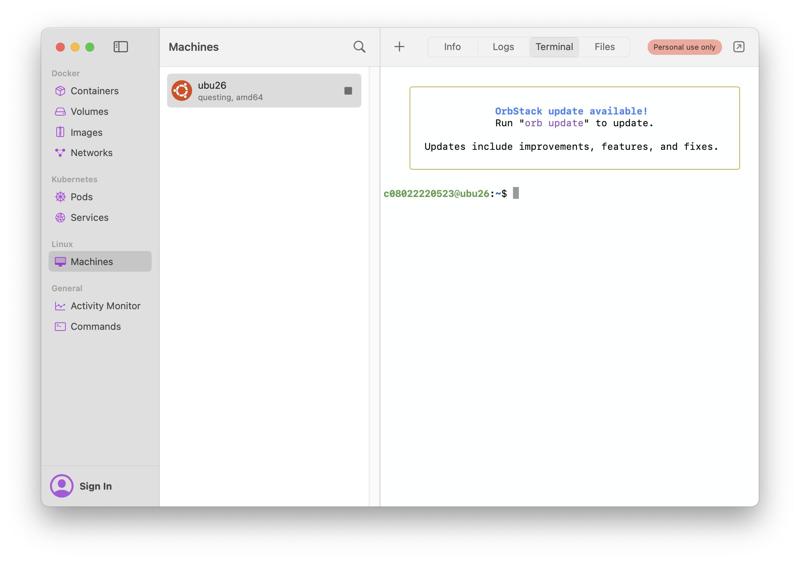
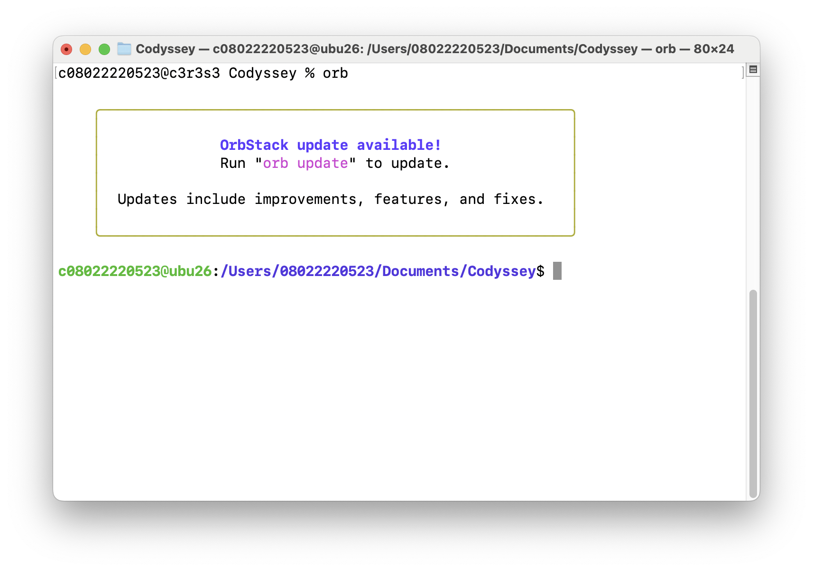

# B1-1 시스템 관제 자동화 스크립트 개발
- 안정적인 서버 운영 환경 직접 구축
- 다중 사용자 환경에서의 권한관리와 네트워크 보안 설정
- 시스템 리소스 관제와 로그 관리를 자동화하는 쉘 스크립트 개발 수행
<br>
<br>

## 핵심 개념
1. SSH 포트변경 & Root 차단
2. 방화벽 (네트워크 보안)
3. 계정/그룹/권한 관리 (최소 권한 원칙)
4. 환경 변수
5. 시스템 모니터링 스크립트
6. 자동 실행 (Crontab)
<br>
<br>

## 수행 증거 (방법1. docker container 이용)
### 공통 - Docker / Container 준비
Codyssey 실습환경은 프로그램 설치가 제한되어 있어서,
제공된 OrbStack 을 사용하여 Docker 를 사용한다.
- docker version 확인
    ```bash
    # docker --version
    c08022220523@c3r2s1 ~ % docker --version
    
    Docker version 28.5.2, build ecc6942
    ```

- 컨테이너 생성 (linux-ubuntu)
    컨테이너를 띄울 때 네트워크/iptabls 를 만질 수 있는 커널 capability 를 열어준다.

    ```bash
    # docker run
    c08022220523@c3r2s1 ~ % docker run -it --name mission-b1-1 --cap-add=NET_ADMIN ubuntu:latest /bin/bash
    ```
    - 기본 도커 컨테이너는 NET_ADMIN 같은 네트워크 관리 capability 가 막혀 있어서 `iptables-restore` 가 Permission denied 가 난다.
    - `--cap-add=NET_ADMIN` 을 주면 해당 컨테이너에 "네트워크 관리" 권한이 붙고, 그안에서 iptables/ufw 명령이 통과 할 수 있게 된다.

- apt 패키지 의존성 관리
    
    컨테이너 내부 진입 후 실행 (프롬프트가 '#' 으로 표시되면 진입된 것 임) 
    ```bash
    root@abc123:/# apt update
    # apt update : 인터넷 저장소에서 설치 가능한 패키지 목록을 받아오기
  
    root@abc123:/# apt upgrade -y
    # 설치된 패키지들을 최신 버전으로 업그레이드 하기 (-y : 업그레이드 후 Yes/No 를 묻는데, 자동으로 Yes 라고 답하는 옵션)

  
    root@abc123:/# apt install -y nano openssh-server ufw cron
    # 4개의 패키지를 설치하고 자동으로 Yes 라고 답하기 (nano : 텍스트 에디터, openssh-server : ssh 서버, ufw : 방화벽, cron : 스케쥴 실행 도구)
    ```
- 컨테이너 나가기 (혹은 Ctrl + D) 
    ```bash
    root@a1b2c3d4e5f6:/# exit
    ```
- 컨테이너 실행만 하기 (백그라운드)
    ```bash
    docker start mission-b1-1
    ```
- 컨테이너에 접속해서 작업하기
    ```bash
    docker start -ai mission-b1-1
    # -i : Interactive,입력받기
    # -a : Attach, 컨테이너의 stdout/stderr를 현재 터미널에 연결해서 출력을 본다
    # -ai : 둘 다
    ```
<br>
<br>

# 1. 기본 보안 설정 (SSH Port 변경 & Root Login 차단)
## 1-1. SSH Port 변경 (22 -> 20022)
SSH Port 는 `sshd_config` 파일에서 설정할 수 있다.

### ssh 관련 설정파일
`sshd_config` : 서버 데몬 설정 (외부 서버 -> 내 서버 접속 시)
- SSH Daemon의 설정파일로, 외부에서 서버로 SSH 접속할 때의 동작을 제어한다.
- `sshd` 는 리눅스에서 항상 실행되고 있는 백그라운드 프로그램이다.


(cf. `ssh_config` : 클라이언트 설정 (내 서버 -> 외부 서버 접속 시))
<br>
<br>

### `sshd_config` 주요 내용
- `Port`: SSH가 사용할 포트 번호 (기본값 22)
- `PermitRootLogin`: root 계정의 원격 로그인 허용 여부
- `PasswordAuthentication`: 비밀번호 인증 허용 여부
- `PubkeyAuthentication`: 공개키 인증 허용 여부
- `Protocol`: SSH 프로토콜 버전 선택 (보안상 2 권장)
- `ListenAddress`: SSH 서버가 특정 IP 주소로만 접속 받도록 설정
<br>
<br>

### 1. 설정파일에서 Port 변경
이미 컨테이너의 **root 권한**을 가지고 있기 때문에 **sudo** 명령어 없이 바로 편집할 수 있다.
```bash
nano /etc/ssh/sshd_config
```
- 포트 변경 전 (22)

    Port 22 를 주석 해제 하고, Port 20022 로 변경한다.
    

- 포트 변경 후 (20022)

    포트 변경 후 SSH 데몬이 20022 포트로 리스닝하도록 설정되었다. 

    
<br>
<br>

### 2. SSH 재시작
- SSH 데몬 재실행
    ```bash
    # service ssh restart
    root@945e0b2ff039:/# service ssh restart
    
    * Restarting OpenBSD Secure Shell server sshd  
    ```
<br>

### 3. Port 변경 확인
- apt upgrade
    ```bash
    # netstat 사용을 위한 apt 업그레이드
    apt-get update

    # netstat 사용을 위한 net-tools 설치
    apt-get install net-tools

    # ss가 포함된 iproute2 설치
    apt-get install -y iproute2
    ```

- 변경 확인
    ```bash
    # 방법1. netstat (Network Statistics)
    # 현재 LISTEN 중인 TCP/UDP 포트 목록 + 그 포트를 잡고 있는 프로세스(PID/이름)를 보여준다.
    netstat -tulnp | grep 20022

    tcp        0      0 0.0.0.0:20022           0.0.0.0:*               LISTEN      4552/sshd: /usr/sbi 
    tcp6       0      0 :::20022                :::*                    LISTEN      4552/sshd: /usr/sbi 


    # 방법2. ss (Socket Statistics)
    # netstat의 최신 버전같은 도구, LISTEN 포트와 프로세스 정보를 더 빠르게 보여준다.
    ss -tulnp | grep 20022

    Netid   State    Recv-Q   Send-Q     Local Address:Port      Peer Address:Port  Process                                                                         
    tcp     LISTEN   0        128              0.0.0.0:20022          0.0.0.0:*      users:(("sshd",pid=4552,fd=6))                                                 
    tcp     LISTEN   0        128                 [::]:20022             [::]:*      users:(("sshd",pid=4552,fd=7))   

    # 방법3. ps aux | grep 프로세스
    # 시스템의 모든 실행중인 프로세스 + 동작 모드 상세 표시 명령어
    ps aux | grep sshd

    root        4552  0.0  0.0  10736  2400 ?        Ss   18:42   0:00 sshd: /usr/sbin/sshd [listener] 0 of 10-100 startups
    root        4625  0.0  0.0   3692  2096 pts/0    S+   18:47   0:00 grep --color=auto sshd
    ```

<br>
<br>


## 1-2. ROOT 로그인 차단 (prohibit-password -> no)
Root 로그인은 sshd_config 파일에서 수정할 수 있다.
- 권한 변경 (전)
    ```bash
    nano /etc/ssh/sshd_config
    ```

    


- 권한 변경 (후)
    ```bash
    cat /etc/ssh/sshd_config
    ```

    

- 서비스 재시작
    ```bash
    root@d1adc33ffdda:/# service ssh restart
    
    * Restarting OpenBSD Secure Shell server sshd   
    ```

- 변경 확인

    PermitRootLogin 이 "no" 로 잘 차단 됨
    

    ```bash
    root@d1adc33ffdda:/# cat /etc/ssh/sshd_config | grep PermitRootLogin
    
    PermitRootLogin no

    # the setting of "PermitRootLogin prohibit-password".
    ```
- PermitRootLogin 의 옵션
    - yes : Root 로그인 허용 (비밀번호 가능)  
    - no : Root 로그인 차단 (완전히 차단)
    - prohibit-password : Root 로그인은 허용하되, 비밀번호 인증은 금지한다. (공개키 인증으로만 접속가능)
<br>
<br>

# 2. 방화벽 설정
### 방화벽 종류
두 가지 방화벽으로 미션을 수행할 수 있는데, 나는 초보자에게 친화적인 UFW 로 골랐다.

1. `UFW` (Uncomplicated Firewall)
- iptables 래퍼
- Ubuntu, Debian
- 초보자 친화적

2. `Firewalld`
- iptables/nftables 래퍼
- RedHat, CentOS, Fedora
- 고급 기능 많음


### 방화벽 설정
- UFW 활성화
    ```bash
    # ufw enable
    root@07c0ae693e1e:/# ufw enable
    
    Firewall is active and enabled on system startup
    ```
- SSH 포트 허용 (20022)
    ```bash
    # ufw allow 20022/tcp
    root@07c0ae693e1e:/# ufw allow 20022/tcp
    
    Rule added
    Rule added (v6)
    ```
- APP 포트 허용 (15034)
    ```bash
    # ufw allow 15034/tcp
    root@07c0ae693e1e:/# ufw allow 15034/tcp

    Rule added
    Rule added (v6)
    ```
- 방화벽 상태 확인
    
    ```bash
    # ufw status
    root@07c0ae693e1e:/# ufw status
    
    Status: active

    To                         Action      From
    --                         ------      ----
    20022/tcp                  ALLOW       Anywhere                  
    15034/tcp                  ALLOW       Anywhere                  
    20022/tcp (v6)             ALLOW       Anywhere (v6)             
    15034/tcp (v6)             ALLOW       Anywhere (v6)         
    
    # 20022/tcp ALLOW, 15034/tcp ALLOW
    ```
<br>
<br>

# 3. 계정/그룹/권한 설정

### 그룹 생성
- agent-common: admin, dev, test
- agent-core: admin, dev

```bash
# groupadd 그룹명

root@07c0ae693e1e:/# groupadd agent-common
root@07c0ae693e1e:/# groupadd agent-core
```

### 그룹 생성 확인
```bash
# getent group | grep agent

root@07c0ae693e1e:/# getent group | grep agent

agent-common:x:1001:
agent-core:x:1002:
```

### 계정 생성
- agent-admin : 관리자
- agent-dev : 스크립트 작성, 실행
- agent-test : 테스트 수행

- `useradd -m -s <사용 할 shell> <계정 명>`

    ```bash
    root@07c0ae693e1e:/# useradd -m -s /bin/bash agent-admin
    root@07c0ae693e1e:/# useradd -m -s /bin/bash agent-dev  
    root@07c0ae693e1e:/# useradd -m -s /bin/bash agent-test
    ```


### 그룹 소속 시키기
- `usermod -aG <그룹 명> <계정 명>`
- `-aG` : 기존 그룹을 유지하면서 보조그룹(G)에 추가(a)
- `-G` : 기존 그룹을 현재 그룹으로 완전히 교체

    ```bash
    # agent-common
    root@07c0ae693e1e:/# usermod -aG agent-common agent-admin
    root@07c0ae693e1e:/# usermod -aG agent-common agent-dev  
    root@07c0ae693e1e:/# usermod -aG agent-common agent-test

    # agent-core
    root@07c0ae693e1e:/# usermod -aG agent-core agent-admin 
    root@07c0ae693e1e:/# usermod -aG agent-core agent-dev 
    ```

### 그룹 설정 후 계정 확인

```bash
# id <계정 명>
root@07c0ae693e1e:/# id agent-admin
uid=1001(agent-admin) gid=1003(agent-admin) groups=1003(agent-admin),1001(agent-common),1002(agent-core)
root@07c0ae693e1e:/# id agent-dev  
uid=1002(agent-dev) gid=1004(agent-dev) groups=1004(agent-dev),1001(agent-common),1002(agent-core)
root@07c0ae693e1e:/# id agent-test
uid=1003(agent-test) gid=1005(agent-test) groups=1005(agent-test),1001(agent-common)

```


### 미션 외 - 계정 수정
- 계정 이름 + 홈 디렉토리 같이 변경
- `usermod -l <계정 명> -d <기존 경로> -m <새 경로>`
- `-l` : 로그인 이름 변경 (old -> new)
- `-d <경로> -m` : 홈 디렉토리도 새 이름으로 이동하면서 변경
    ```bash
    usermod -l agent-admin -d /home/agent-admin-before -m agent-admin2-after
    ```

### 미션 외 - 계정 삭제
- `userdel -r <계정 명>`
- `-r` : 설정했던 하위 옵션까지 삭제해라

    ```bash
    userderl -r agent-admin

    # userdel 만 실행할 경우 남아 있는 홈 디렉터리 삭제 필요
    rm -rf /hone/agent-admin
    ```

    
### 디렉토리 및 권한 설정
- $AGENT_HOME (예: /home/agent-admin/agent-app)
- $AGENT_HOME/upload_files
- $AGENT_HOME/api_keys
- /var/log/agent-app

```bash
# 1) AGENT_HOME 디렉토리 생성 (agent-admin 계정으로)
sudo mkdir -p /home/agent-admin/agent-app
sudo mkdir -p /home/agent-admin/agent-app/bin
sudo mkdir -p /home/agent-admin/agent-app/upload_files
sudo mkdir -p /home/agent-admin/agent-app/api_keys

# 2) 소유자 변경
sudo chown -R agent-admin:agent-core /home/agent-admin/agent-app

# 3) upload_files 권한 (agent-common 모두 접근 가능)
sudo chmod 770 /home/agent-admin/agent-app/upload_files
sudo chgrp agent-common /home/agent-admin/agent-app/upload_files

# 4) api_keys 권한 (agent-core만 접근)
sudo chmod 750 /home/agent-admin/agent-app/api_keys
sudo chgrp agent-core /home/agent-admin/agent-app/api_keys

# 5) 로그 디렉토리 생성
sudo mkdir -p /var/log/agent-app
sudo chown agent-admin:agent-core /var/log/agent-app
sudo chmod 770 /var/log/agent-app

# 6) 확인
ls -l /home/agent-admin/agent-app/
getfacl /home/agent-admin/agent-app/upload_files
getfacl /home/agent-admin/agent-app/api_keys
```
<br>
<br>

# 4. 환경변수
### 환경변수 설정
```bash
# 1) agent-admin의 bash 프로필에 환경 변수 추가
sudo nano /home/agent-admin/.bashrc

# 맨 끝에 추가:
export AGENT_HOME=/home/agent-admin/agent-app
export AGENT_PORT=15034
export AGENT_UPLOAD_DIR=$AGENT_HOME/upload_files
export AGENT_KEY_PATH=$AGENT_HOME/api_keys/t_secret.key
export AGENT_LOG_DIR=/var/log/agent-app

# 2) 적용
source /home/agent-admin/.bashrc

# 3) 확인
echo $AGENT_HOME
# 결과: /home/agent-admin/agent-app
```

### API 키 생성
```bash
# 1) agent-admin으로 전환 (또는 sudo -u agent-admin)
sudo -u agent-admin bash

# 2) 키 파일 생성
echo "agent_api_key_test" > /home/agent-admin/agent-app/api_keys/t_secret.key

# 3) 권한 설정
chmod 640 /home/agent-admin/agent-app/api_keys/t_secret.key

# 4) 확인
cat /home/agent-admin/agent-app/api_keys/t_secret.key
```

### 앱 실행
```bash
# 1) agent-app.zip 다운로드 & 추출
# 제공된 파일을 $AGENT_HOME에 배치

# 2) agent-admin으로 실행
sudo -u agent-admin bash

cd $AGENT_HOME

python3 agent_app.py


# 3) 정상 출력 확인:
# > Starting Agent Boot Sequence...
# [1/5] Checking User Account [OK]
# [2/5] Verifying Environment Variables [OK]
# [3/5] Checking Required Files [OK]
# [4/5] Checking Port Availability [OK]
# [5/5] Verifying Log Permission [OK]
# All Boot Checks Passed!
# Agent READY

# 4) 다른 터미널에서 포트 확인
ss -tulnp | grep 15034
# 결과: 0.0.0.0:15034 LISTEN
```
<br>
<br>

# 5. 모니터링 스크립트
자동으로 시스템의 상태를 체크하고 기록한다.

수동 모니터링 시 매 분 체크가 불가능하며, 실수하기 쉽고 기록이 없는 반면, 자동 모니터링 시 24/7 감시 가능하며, 휴먼에러가 없고 기록이 남아 데이터 기반 분석이 가능하다.


### monitor.sh 의 5가지 기능
1. 헬스 체크 (실패 시 종료)
    - 프로세스 : `agent_app.py` 가 실행중 인지 확인
    - 포트 : 15034 수신중 인지 확인
2. 경고 체크 (경고만 출력)
    - 방화벽 활성화
3. 자원 수집
    - CPU 사용률
    - 메모리 사용률
    - 디스크 사용률
4. 임계값 경고
5. 로그 기록
    - `/var/log/agent-app/monitor.log` 에 저장 됨

### 스크립트 생성
```bash
# 파일 생성
sudo nano /home/agent-admin/agent-app/bin/monitor.sh

# 권한 설정 (750 = rwxr-x---)
sudo chown agent-dev:agent-core /home/agent-admin/agent-app/bin/monitor.sh
sudo chmod 750 /home/agent-admin/agent-app/bin/monitor.sh

# 수동 실행 테스트
sudo -u agent-admin /home/agent-admin/agent-app/bin/monitor.sh
```
<br>
<br>

# 6. 자동 실행 설정 (30분)
자동으로 모니터링 스크립트 실행

### crontab 등록
```bash
# agent-admin의 crontab 편집
sudo crontab -u agent-admin -e

# 다음 라인 추가 (매분 실행):
* * * * * /home/agent-admin/agent-app/bin/monitor.sh

# 확인
sudo crontab -u agent-admin -l
```

### 자동실행 확인
```bash
# 1) 현재 로그 수 확인
wc -l /var/log/agent-app/monitor.log

# 2) 2분 대기
sleep 120

# 3) 로그 수 증가 확인
wc -l /var/log/agent-app/monitor.log

# 4) 최근 로그 확인
tail /var/log/agent-app/monitor.log
```
<br>
<br>

## 수행 증거 (방법 2. Orbstack-Linux Machines)

### orbstack 
orbstack을 이용해 가상의 리눅스 환경을 만들어 root 권한을 이용할 수 있다.

GUI / CLI 두 방법 모두 사용 가능하다.

- GUI
    

- CLI
    

```bash
# orbstack 접속
orb
```


```bash
# orb 가상환경으로 파일 가져오기
# orb push -m <가상환경 이름> <가져올 파일 이름>
c08022220523@c3r3s3 Desktop % orb push -m ubu26 test.txt 

```
<br>
<br>

# 트러블 슈팅
# 1. SSH 에서 포트 변경 후 재시작이 안됨

## 문제
컨테이너 환경에서 SSH 포트 변경 후 systemd 재시작을 명령했지만, 진행되지 않음
```bash
root@945e0b2ff039:/# systemctl restart ssh

System has not been booted with systemd as init system (PID 1). Can't operate.
Failed to connect to system scope bus via local transport: Host is down
```
<br>
<br>

## 원인
Docker 컨테이너는 systemd 가 기본적으로 실행되지 않기 때문이다.

컨테이너는 호스트의 커널을 공유하지만 systemd 같은 초기화 시스템은 컨테이너 내부에서 실행되지 않아서 `systemctl` 명령어를 사용할 수 없다.

<br>
<br>

## 해결
컨테이너에서는 systemctl 대신 `SSH 데몬`을 직접 실행해야 한다.

`Ubuntu / Debian` 계열
- SSH 데몬 재실행
    ```bash
    # service ssh restart
    root@945e0b2ff039:/# service ssh restart
    
    * Restarting OpenBSD Secure Shell server sshd
    ```

- 기타 방법 1. 직접 실행 방법
    ```bash
    /usr/sbin/sshd
    ```

- 기타 방법 2. 백그라운드 실행
    ```bash
    nohup /usr/sbin/sshd &
    ```

- 변경 완료 (port 가 22 -> 20022 로 변경 됨)
    ```bash
    # 방법1. netstat -nlp | grep sshd
    root@945e0b2ff039:/# netstat -nlp | grep sshd

    tcp        0      0 0.0.0.0:20022           0.0.0.0:*               LISTEN      30/sshd: /usr/sbin/ 
    tcp6       0      0 :::20022                :::*                    LISTEN      30/sshd: /usr/sbin/

    # 방법2. netstat -tulnp | grep 20022
    root@945e0b2ff039:/# netstat -tulnp | grep 20022

    tcp        0      0 0.0.0.0:20022           0.0.0.0:*               LISTEN      30/sshd: /usr/sbin/ 
    tcp6       0      0 :::20022                :::*                    LISTEN      30/sshd: /usr/sbin/ 
    ```
<br>
<br>

# 트러블 슈팅
# 2. sudo / root 권한이 필요한 작업 수행 문제

## 문제
미션을 수행하는 과정에서 `sudo` 또는 `root` 권한이 필요한 작업이 여러 번 발생했다. 대표적으로 SSH 설정 변경, 방화벽(UFW) 활성화, 계정/그룹 생성, 시스템 디렉토리 권한 설정 같은 작업은 일반 사용자 권한만으로 수행하기 어렵다.

하지만 교육장 실습 환경에는 다음과 같은 제약이 있었다.
- iMac 호스트 환경에서 프로그램 설치가 불가능했다.
- 호스트 터미널 계정은 sudoers에 포함되어 있지 않아 `sudo` 명령을 사용할 수 없었다.
- 이를 우회하기 위해 Docker 컨테이너를 생성해 내부에서 작업을 진행했지만, 컨테이너 기본 권한만으로는 방화벽 설정이 정상 동작하지 않았다.

## 원인
Docker 컨테이너 내부의 root 사용자는 호스트 운영체제의 진짜 root와 다르다. 컨테이너 안에서 root 프롬프트를 사용하더라도, 호스트 커널의 네트워크 필터링 기능(iptables/nftables)을 직접 제어할 권한은 기본적으로 제한된다.

`UFW`는 내부적으로 `iptables` 계열 명령을 사용해 방화벽 규칙을 적용한다. 따라서 일반적인 Docker 컨테이너에서는 네트워크 관리 capability가 없기 때문에 ufw enable 실행 시 `Permission denied` 또는 `problem running ufw-init` 같은 오류가 발생한다.

## 해결
방법 1. Docker 컨테이너 생성 시 NET_ADMIN 권한 추가

컨테이너를 생성할 때 `--cap-add=NET_ADMIN` 옵션을 추가하면 네트워크 관리 capability가 부여되어, 컨테이너 내부에서도 UFW 또는 iptables 기반 명령이 동작할 수 있다.

예시:

```bash
docker run -it --name mission-b1-1 --cap-add=NET_ADMIN ubuntu:latest /bin/bash
```

이 방식은 필요한 네트워크 권한만 추가하는 방법이라, `--privileged`보다 범위를 좁게 제어할 수 있다는 장점이 있다.

방법 2. `OrbStack` 등 가상화 환경에서 작업

OrbStack, VM, 또는 별도의 Ubuntu 실습 환경처럼 사용자가 root 권한을 직접 제어할 수 있는 가상화 환경에서는 방화벽 설정, 계정 생성, 시스템 디렉토리 권한 변경 같은 작업을 더 자연스럽게 수행할 수 있다.

특히 이번 미션은 “Ubuntu 22.04 LTS 또는 동등 리눅스 환경”을 전제로 하고 있으므로, 컨테이너/VM을 하나의 독립된 리눅스 서버처럼 구성해 실습하는 방식이 과제 의도와도 잘 맞는다. 