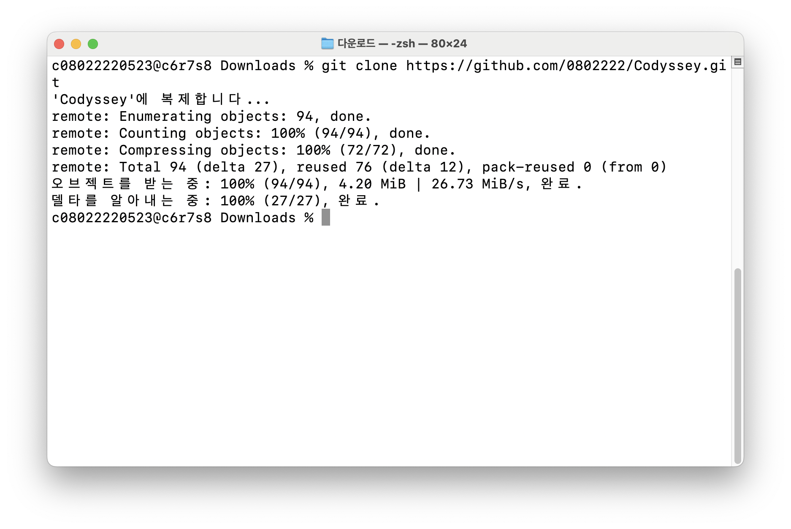
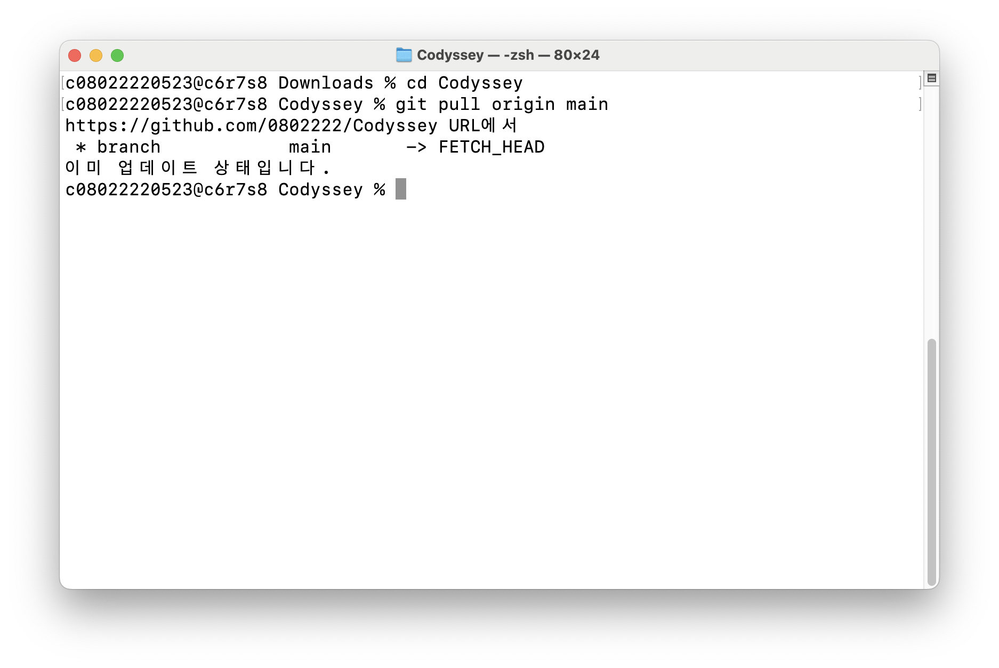
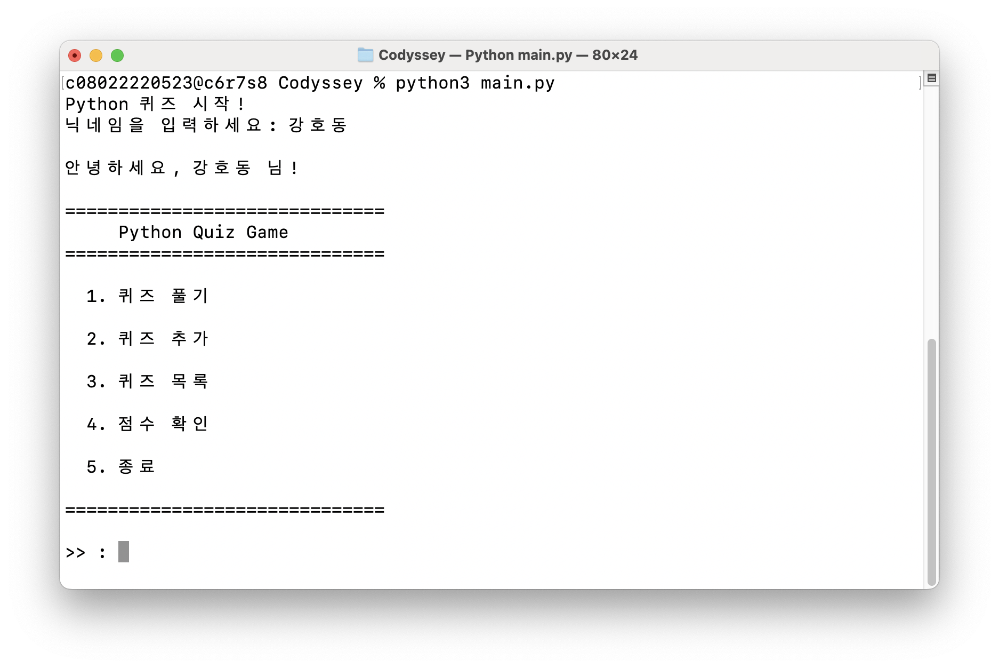
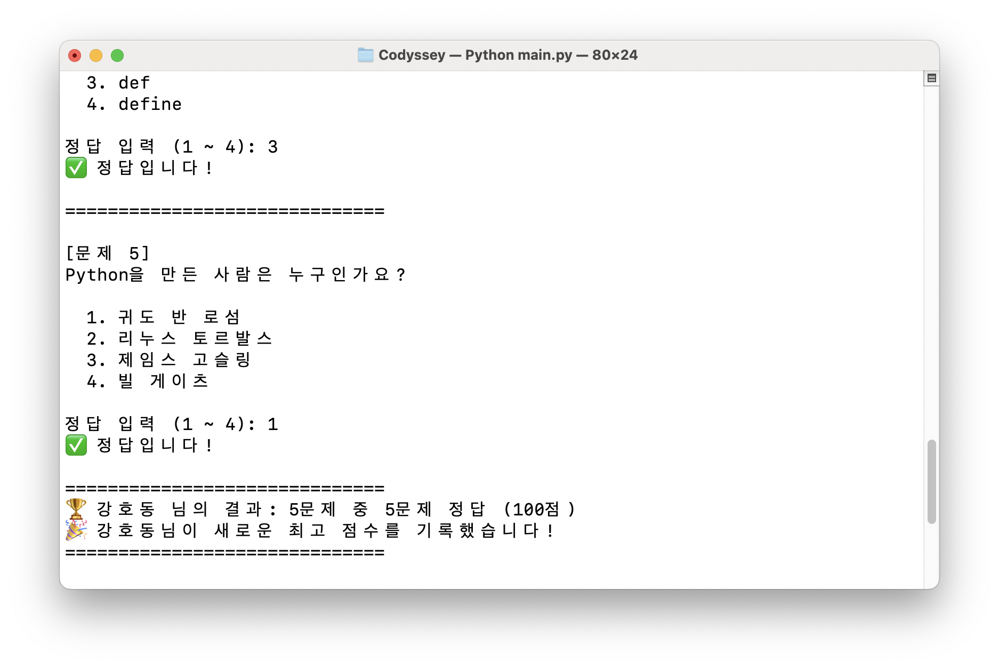
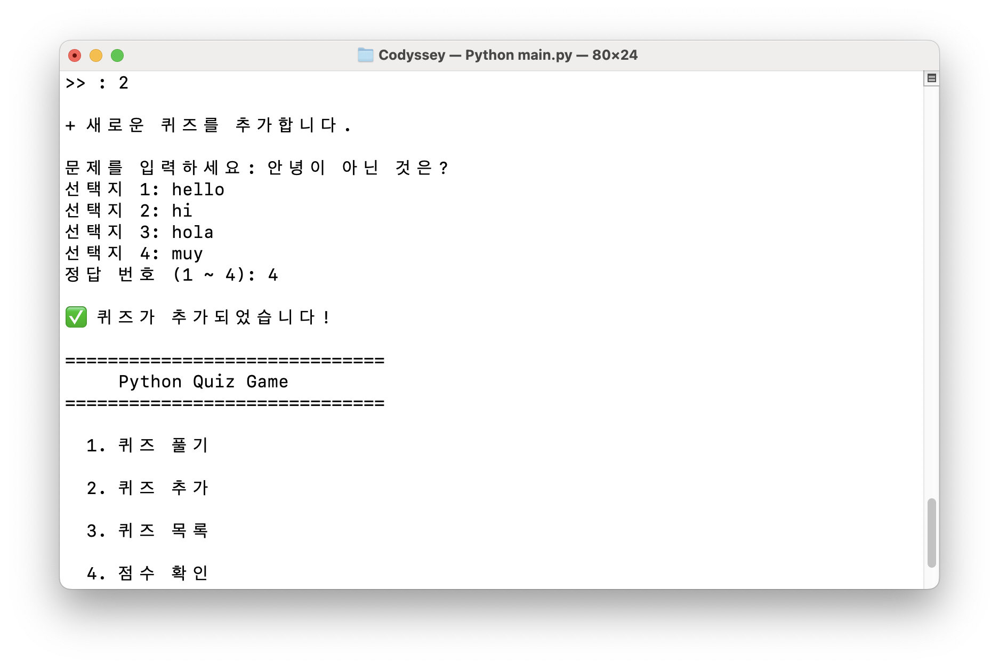
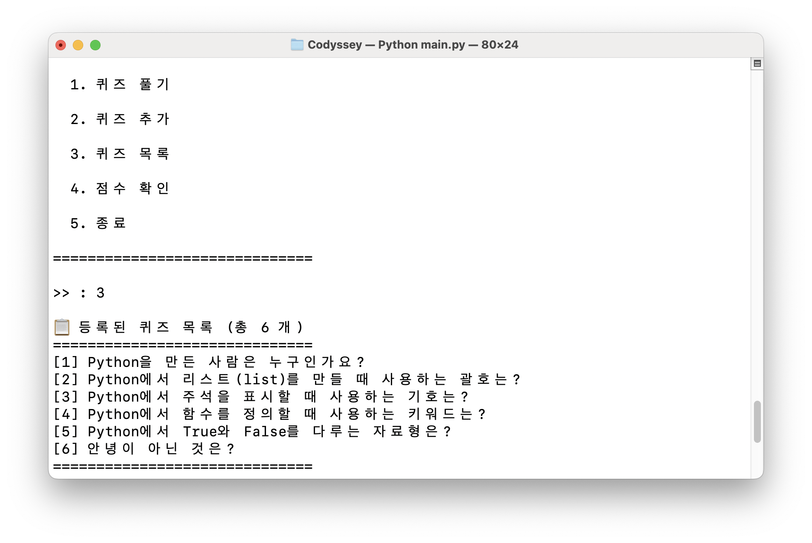
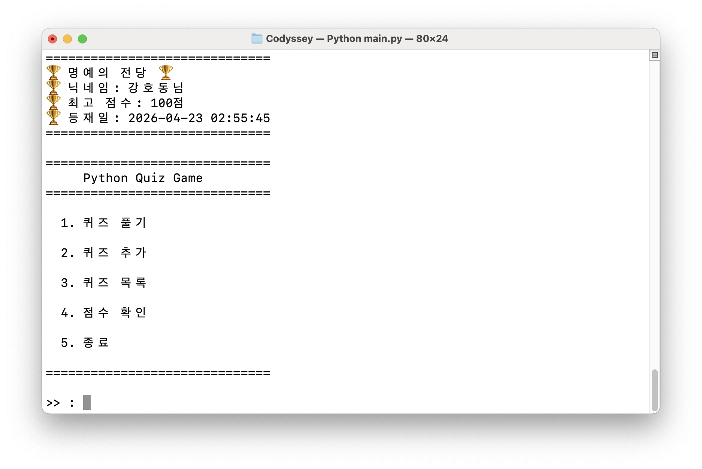

# Python Quiz Game

Python 기본 문법과 객체 지향 프로그래밍을 활용한 터미널 퀴즈 게임입니다.

---

<br>
<br>

## 0. 프로젝트 개요

터미널에서 실행되는 퀴즈 게임으로, 퀴즈 풀기 / 추가 / 목록 확인 / 점수 저장 기능을 제공합니다.  
`Quiz`와 `QuizGame` 두 클래스로 역할을 나누어 구조화했으며, `state.json` 파일로 데이터를 영속적으로 관리합니다.

---

<br>
<br>

## 1. 퀴즈 주제 선정 이유

**주제: Python 기초 문법**

Python을 처음 배우는 입장에서 직접 만든 퀴즈로 복습하면 더 오래 기억에 남을 것이라 생각했습니다.  
문법 개념을 문제로 바꾸는 과정 자체가 학습이 되었습니다.

---

<br>
<br>

## 2.  실행 방법

```bash
  python main.py
```

- Python 3.10 이상 필요, 외부 라이브러리 없음

---

<br>
<br>

## 3. 기능 목록

| 번호 | 기능 | 설명 |
|------|------|------|
| 0 | 닉네임 입력 | (추가로 구현함) 게임정보 저장을 위해 생성
| 1 | 퀴즈 풀기 | 저장된 퀴즈를 랜덤 순서로 출제, 결과 및 최고 점수 갱신 |
| 2 | 퀴즈 추가 | 문제·선택지 4개·정답 번호를 입력받아 저장 |
| 3 | 퀴즈 목록 | 등록된 퀴즈 전체 목록 출력 |
| 4 | 점수 확인 | 최고 점수 확인 |
| 5 | 종료 | 데이터 저장 후 프로그램 종료 |

**보너스 기능**
- 닉네임 입력 기능
- 퀴즈 출제 시 문제 순서 랜덤 섞기 (`random.shuffle`)
- 명예의 전당 기능 제공 (닉네임, 퀴즈 종료시간)

---

<br>
<br>

## 4. 파일 구조 📁

```
mission2/
├── Quiz.py            # 퀴즈 관리
├── QuizGame.py        # 퀴즈 게임 진행
├── main.py            # 실행
├── state.json         # 퀴즈 데이터 및 최고 점수 저장 파일 (자동 생성)
├── .gitignore
├── README.md
└── docs/screenshots   # 실행 결과 스크린샷
    ├── menu.png
    ├── play.png
    ├── add_quiz.png
    └── score.png    
```

---

<br>
<br>

## 5. 데이터 파일 설명 (`state.json`) 🗄️

**파일 설명**
- **경로**: 프로젝트 루트 `./state.json`
- **역할**: 퀴즈 목록과 최고 점수를 프로그램 종료 후에도 유지
- **인코딩**: UTF-8
- **자동 생성**: 첫 실행 시 기본 퀴즈 5개로 자동 생성됨

<br>

**스키마 예시**

```json
{
  "quizzes": [
    {
      "question": "Python을 만든 사람은 누구인가요?",
      "choices": ["귀도 반 로섬", "리누스 토르발스", "제임스 고슬링", "빌 게이츠"],
      "answer": 1
    }
  ],
  "best_score": 80
}
```

<br>

| 필드 | 타입 | 설명 |
|------|------|------|
| `quizzes` | array | Quiz 객체 목록 |
| `quizzes[].question` | string | 문제 텍스트 |
| `quizzes[].choices` | array(4) | 선택지 4개 |
| `quizzes[].answer` | int (1~4) | 정답 번호 |
| `best_score` | int | 최고 점수 (0~100) |

---

<br>
<br>
<br>

## 6. 실행 화면 스크린샷 📸

스크린샷은 `docs/screenshots/` 폴더에 있습니다.
- `git clone.png` - 깃 클론
  
- `git pull` - 깃 풀
  
- `menu.png` — 메인 메뉴
  
- `play.png` — 퀴즈 풀기
  
- `add_quiz.png` — 퀴즈 추가
  
- `show_quiz_list.png` - 퀴즈 목록
  
- `score.png` — 점수 확인
  

## 7. 알게된 점
### 1. import 방식
- Java: 보통 `클래스 단위`로 import 하고, 메서드는 그 클래스의 멤버로 호출한다. (static import로 정적 메서드를 짧게 부를 수는 있음)
- Python: from 모듈 import `함수/클래스` 형태로 함수만 골라서 가져와 쓸 수 있다.
  ``` python
  from QuizGame import QuizGame       # 클래스
  from utils import validate_answer   # 함수(메서드 역할)
  ```


### 2. 예외처리 방식
- Java: `try`-`catch`-`finally` + `throw`
- Python: `try`-`except`-`else`-`finally` + `raise`