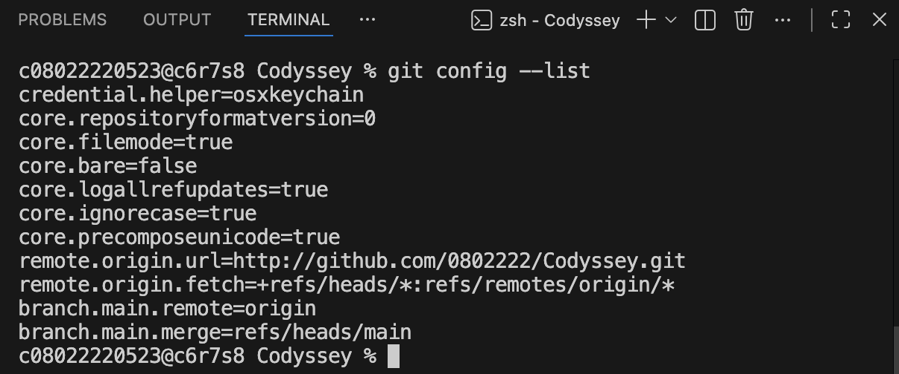
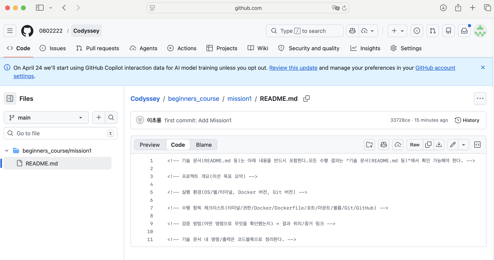

<!-- 기술 문서(README.md 등)는 아래 내용을 반드시 포함한다.모든 수행 결과는 “기술 문서(README.md 등)”에서 확인 가능해야 한다. -->

# 프로젝트 개요(미션 목표 요약)
### 개발 환경 학습 및 세팅
- CLI (terminal)
    - 작업 디렉토리
    - 권한
- Docker
    - 설치 및 점검
    - 컨테이너 실행 및 관리
    - 포트 매핑
    - 바인드 마운트/볼륨 으로 `변경 반영`과 `데이터 영속성` 검증
- Git / GitHub
    - 협업기반 소스코드 관리

## 1) 실행 환경
- OS: macOS 15.7.4
``` bash 
$ c08022220523@c6r7s8 Codyssey % sw_vers
ProductName:            macOS
ProductVersion:         15.7.4
BuildVersion:           24G517
```


- Shell: bash
``` bash 
$ c08022220523@c6r7s8 Codyssey % bash --version
GNU bash, version 3.2.57(1)-release (x86_64-apple-darwin24)
Copyright (C) 2007 Free Software Foundation, Inc.
```

- Docker: 28.5.2
``` bash 
$ c08022220523@c6r7s8 Codyssey % docker --version
Docker version 28.5.2, build ecc6942
```

- git: 2.53.0
``` bash $ c08022220523@c6r7s8 Codyssey % git --version
git version 2.53.0
```

<!-- 수행 항목 체크리스트(터미널/권한/Docker/Dockerfile/포트/마운트/볼륨/Git/GitHub) -->
## 2) 수행 체크리스트
- [x] 터미널 기본 조작 및 폴더 구성
- [x] 권한 변경 실습
- [x] Docker 설치/점검
- [x] hello-world 실행
- [x] Dockerfile 빌드/실행
- [x] 포트 매핑 접속(2회)
- [x] 바인드 마운트 반영
- [x] 볼륨 영속성
- [x] Git 설정 + VSCode GitHub 연동

## 3) 수행 로그
### 3-1) 터미널 조작 로그
- 현재 위치 확인
    ``` bash $
    c08022220523@c6r7s8 Codyssey % pwd
    /Users/08022220523/Documents/Codyssey
    ```

- 목록 확인(숨김 파일 포함)
    ``` bash $
    c08022220523@c6r7s8 Codyssey % ls -a
    .                       ..                      .git                    beginners_course
    ```
- 이동
    ``` bash $
    cd
    ```
- 생성 
    ``` bash $
    touch
    ```
- 복사
    ``` bash $
    cp
    ```
- 이동/이름변경
    ``` bash $
    mv
    ```
- 삭제
    ``` bash $
    rm
    ```

- 파일 내용 확인 
    ``` bash $
    cat
    ```
- 빈 파일 생성
    ``` bash $
    touch
    ```


### 3-2) 권한 실습 및 증거 기록
- 권한 확인 명령어
    ``` bash $
    c08022220523@c6r7s8 Codyssey % ls -al
    total 0
    drwxr-xr-x   4 c08022220523  c08022220523  128 Apr  8 14:22 .
    drwx------+  4 c08022220523  c08022220523  128 Apr  8 14:15 ..
    drwxr-xr-x  13 c08022220523  c08022220523  416 Apr  8 14:29 .git
    drwxr-xr-x   3 c08022220523  c08022220523   96 Apr  8 14:19 beginners_course
    ```
- 권한 변경 명령어
    ``` bash $

    ```

### 3-3) Docker 설치 및 기본 점검
- Docker 버전 확인 결과
    ``` bash $
    $ c08022220523@c6r7s8 Codyssey % docker --version
    Docker version 28.5.2, build ecc6942
    ```
- Docker 데몬 동작 여부 확인 결과를 기록
    ``` bash $
    docker info
    ```
<!-- 5. Docker 기본 운영 명령 수행 -->
- 이미지: 다운로드/목록 확인
    ``` bash $
    docker images
    ```
- 컨테이너: 실행/중지/목록 확인
    ``` bash $
    c08022220523@c6r7s8 Codyssey % docker ps
    CONTAINER ID   IMAGE     COMMAND   CREATED   STATUS    PORTS     NAMES
    ```

    ``` bash $
    docker ps -a
    ```

### 3-4) 도커 기본 운영 명령 수행
- 운영: 로그 확인, 리소스 확인
    ``` bash $
    docker logs
    ```

    ``` bash $
    docker stats    
    ```

### 3-5) 컨테이너 실행 실습
- hello-world 실행 성공을 기록한다.
    ``` bash $
    
    ```

- ubuntu 컨테이너를 실행하고 내부 진입 후 간단 명령(예: ls, echo) 수행 결과를 기록한다.
    ``` bash $
    
    ```

- 컨테이너 종료/유지(attach/exec 등)의 차이를 스스로 관찰하고 간단히 정리한다.
    ``` bash $
    
    ```

### 3-6) 기존 Dockerfile 기반 커스텀 이미지 제작

- 아래 방식 중 하나를 선택하여 기존 Dockerfile/이미지 기반의 커스텀 이미지를 만든다.
    - (A) 웹 서버 베이스 이미지 활용(예: NGINX/Apache 등) + 정적 콘텐츠/설정만 교체
    - (B) Linux 베이스 이미지(예: ubuntu/alpine 등) + 기본 기능(패키지/사용자/환경변수/헬스체크 등) 추가

- 제작 결과는 아래 조건을 만족해야 한다.
    - 커스텀 이미지 빌드 성공 및 컨테이너 실행 성공
    - 기술 문서에 다음을 포함한다.
        - 어떤 “기존 베이스(이미지/예시 Dockerfile)”를 선택했는지
        - 내가 적용한 커스텀 포인트 각각의 목적(간단 요약)
        - 빌드/실행 명령 + 핵심 결과(출력/스크린샷)
    ``` bash $
    
    ```

- 포트 매핑 및 접속 증거
    ``` bash
    $ docker build -t my-web:1.0 .
    $ docker run -d -p 8080:5000 --name my-web-8080 my-web:1.0
    $ curl <http://localhost:8080>
    Hello

    $ docker run -d -p 8081:5000 --name my-web-8081 my-web:1.0
    $ curl <http://localhost:8081>
    Hello
    ```

- Docker 볼륨 영속성 검증
    ``` bash
    $ docker volume create mydata
    $ docker run -d --name vol-test -v mydata:/data ubuntu sleep infinity
    $ docker exec -it vol-test bash -lc "echo hi > /data/hello.txt && cat /data/hello.txt"
    hi
    $ docker rm -f vol-test

    $ docker run -d --name vol-test2 -v mydata:/data ubuntu sleep infinity
    $ docker exec -it vol-test2 bash -lc "cat /data/hello.txt"
    hi
    ```

- Git 설정 및 GitHub 연동
    ``` bash
    $ c08022220523@c6r7s8 Codyssey % git config --list
    credential.helper=osxkeychain
    core.repositoryformatversion=0
    core.filemode=true
    core.bare=false
    core.logallrefupdates=true
    core.ignorecase=true
    core.precomposeunicode=true
    remote.origin.url=http://github.com/0802222/Codyssey.git
    remote.origin.fetch=+refs/heads/*:refs/remotes/origin/*
    branch.main.remote=origin
    branch.main.merge=refs/heads/main
    ```

- 보안 및 개인정보
    - [x] 토큰, 비밀번호, 개인키, 인증코드 등이 포함되지 않도록 마스킹한다.






## 4) 트러블 슈팅 (문제 -> 원인 가설 -> 확인 -> 해결/대안)
### 4-1) 트러블 슈팅_1 : 
- 문제
    ``` text

    ```
- 원인 가설
    ``` text

    ```
- 확인
    ``` text

    ```
- 해결 / 대안
    ``` text

    ```


### 4-2) 트러블 슈팅_2 : 
- 문제
    ``` text

    ```
- 원인 가설
    ``` text

    ```
- 확인
    ``` text

    ```
- 해결 / 대안
    ``` text

    ```

##  5) 보너스 과제
### 5-1) Docker Compose 기초
- docker-compose.yml의 기본 구조를 학습하고, 단일 서비스를 Compose로 실행한다.
- 배움 포인트: 컨테이너 실행 명령이 “문서화된 실행 설정”으로 바뀌는 이유

### 5-2) Docker Compose 멀티 컨테이너
- 웹 서버 + (임의의 보조 서비스) 2개 이상을 Compose로 함께 실행한다.
- 컨테이너 간 네트워크 통신이 가능한지 확인한다.
- 배움 포인트: 네트워크/서비스 디스커버리 개념 맛보기

### 5-3) Compose 운영 명령어 습득
- up, down, ps, logs를 사용해 실행/종료/상태/로그를 관리한다.
- 배움 포인트: 운영 관점의 “상태 확인 루틴” 만들기

### 5-4) 환경 변수 활용
- Dockerfile 또는 Compose에서 환경 변수를 주입해 서버 포트/모드를 바꿔본다.
- 배움 포인트: 설정과 코드의 분리

### 5-5) GitHub SSH 키 설정
- HTTPS 대신 SSH로 푸시가 가능하도록 키를 등록하고 동작을 확인한다.
- 배움 포인트: 인증 방식 차이와 보안 습관